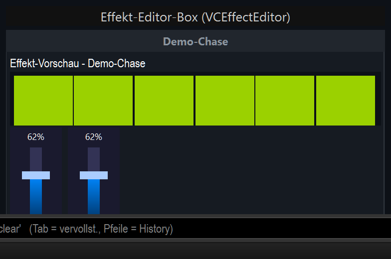
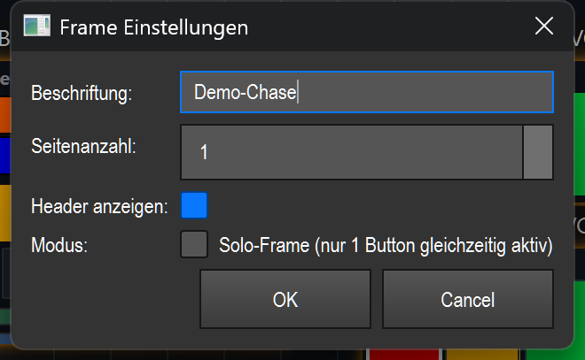

# Effekt-Editor-Box (`VCEffectEditor`)

> Eine bewegliche Box, die einen Effekt live im Miniaturformat vorschaut und darunter die Bedienelemente bereitstellt, die du dir aus den steuerbaren Aspekten des Effekts aussuchst — der „Streifen“ für einen einzelnen Effekt.

## Wozu & was es steuert

Die Effekt-Editor-Box bündelt alles, was du zu **einem** Effekt brauchst, in einer einzigen verschiebbaren Box:

- **oben:** eine kleine **Live-Vorschau** des Effekts in der echten Gerätegeometrie (Spalten × Reihen wie beim gebundenen Effekt) — du siehst das laufende Muster, ohne auf die Bühne zu schauen.
- **darunter:** die **Bedienelemente**, die du beim Anlegen aus den steuerbaren Aspekten des Effekts auswählst (Tempo/Helligkeit/Farben/Bewegung/einzelne Parameter/Aktionen) — je nach Aspekt als Fader, Knopf, Auswahl oder XY-Feld. Sie wirken sofort auf den laufenden Effekt.

Du nimmst die Box, wenn du einen Effekt nicht nur starten, sondern **während der Show feinjustieren** willst (schneller/langsamer, heller/dunkler, größer/kleiner) und dabei gleich eine Kontrollvorschau haben möchtest.

Wichtig: Die Box ist eine spezialisierte Variante des Frame-Containers (siehe Übersicht in der README.md). Sie wird **nur** für Effekte mit echten Live-Parametern angelegt — typisch **Matrix-/EFX-Effekte**. Für Typen ohne Live-Parameter (z. B. reine Szene/Chaser) wird kein Editor-Band gebaut.

## So sieht es aus & Bedienung im Betrieb

Die Box hat von oben nach unten drei Bereiche:

1. **Header-Leiste (oben):** dunkler Balken mit dem **Effektnamen** als Beschriftung (im Bild „Demo-Chase“). Der Name wird beim Binden automatisch vom Effekt übernommen. Bei mehreren Seiten zeigt der Header stattdessen die Seiten-Tabs `P1`, `P2` …; bei nur einer Seite den zentrierten Namen.
2. **Vorschau-Band (Mitte):** beschriftet mit „**Effekt-Vorschau – <Name>**“. Es zeigt das laufende Effektmuster als Kachel-Raster in der echten Spalten-/Reihen-Geometrie des Effekts (im Bild sechs grün leuchtende Zellen). Die Vorschau ist eine reine Anzeige — sie animiert nur, solange die Box sichtbar ist (auf einer anderen Bank/Seite stoppt der Animations-Timer, das spart CPU).
3. **Bedienelement-Bereich (unten):** die von dir gewählten Regler/Knöpfe (im Bild zwei Fader, jeweils mit Prozent-Anzeige „62 %“ obendrauf). Jedes Element steuert einen Live-Aspekt des Effekts.

**Bedienung im Betrieb (Bearbeiten-Modus AUS):**

| Zone / Geste | Was passiert |
|---|---|
| **Fader ziehen** (vertikal) | Setzt den zugehörigen Effekt-Parameter absolut (0–100 %). Die Wirkung ist sofort sichtbar, weil der Effekt jeden Frame den frischen Wert liest. |
| **Klick auf einen Seiten-Tab** `P1/P2…` | Wechselt die Seite der Box (nur wenn mehrere Seiten konfiguriert sind). |
| **Klick ins Vorschau-Band** | Keine Funktion — reine Anzeige. |
| **Klick in den Header / leeren Bereich** | Keine Steuer-Funktion im Betrieb. |

**Im Bearbeiten-Modus (AN):** Die Box lässt sich frei **verschieben** und an der unteren rechten Ecke **skalieren**; die Fader skalieren mit der Box-Höhe. Du kannst die Box per Drag in/aus anderen Frames ziehen (Snap-in/Snap-out). Doppelklick öffnet die Einstellungen; Rechtsklick öffnet das Kontextmenü (siehe README.md).

> Hinweis: Die Box hat **keinen eigenen Toolbar-Knopf**. Sie entsteht über **Smart-Drop** — du ziehst einen Effekt aus der Bibliothek auf die Canvas, und LightOS legt für passende Effekte automatisch diese Box samt Vorschau an und öffnet gleich die Bedienelement-Auswahl.

## Einstellungen

Doppelklick (oder Rechtsklick → „Einstellungen…“) öffnet den Dialog **„Frame Einstellungen“** — die Box erbt ihn von der Frame-Basisklasse.

| Einstellung | Bedeutung | Werte/Optionen |
|---|---|---|
| **Beschriftung** | Text im Header. Beim Binden eines Effekts wird er automatisch auf den Effektnamen gesetzt; hier kannst du ihn überschreiben. | freier Text (im Bild „Demo-Chase“) |
| **Seitenanzahl** | Anzahl der Seiten/Tabs der Box. Bei mehr als 1 erscheinen oben Tabs `P1…Pn`, zwischen denen du blätterst; jedes Kind-Widget gehört zu einer Seite. | Ganzzahl **1–10** (Standard 1) |
| **Header anzeigen** | Blendet die obere Titel-/Tab-Leiste ein oder aus. Ausgeblendet rückt der Inhalt nach oben. | An / Aus (Standard: An) |
| **Modus** | „**Solo-Frame**“: In dieser Box kann immer nur **ein** Button gleichzeitig aktiv sein — beim Drücken eines Buttons werden die anderen in der Box automatisch deaktiviert. Für reine Fader ohne Belang. | Häkchen „Solo-Frame (nur 1 Button gleichzeitig aktiv)“ (Standard: Aus) |

> Der Dialog steuert den **Container** (Beschriftung, Seiten, Header, Solo). Die eigentliche Effekt-Bindung und die Vorschau werden beim Anlegen über Smart-Drop gesetzt und beim Speichern/Laden mitgesichert (siehe nächster Abschnitt). Die **Live-Parameter** der einzelnen Fader stellst du am jeweiligen Fader selbst ein, nicht in diesem Dialog.

## Bindung an einen Effekt

Die Box selbst speichert die **Effekt-ID** (`effect_id`) und stellt damit ihren Inhalt her:

- **Binden:** Du bindest nicht von Hand — die Bindung entsteht automatisch beim **Smart-Drop** (Effekt aus der Bibliothek auf die Canvas ziehen). LightOS prüft den Zieleffekt: Nur Effekte mit einem **Algorithmus und Live-Parametern** (Matrix/EFX) bekommen die Box samt Vorschau und Bedienelement-Auswahl.
- **Was beim Binden passiert:** Der Header übernimmt den Effektnamen; die Vorschau wird auf die echte Geometrie des Effekts (Spalten/Reihen, Farben, Geschwindigkeit) gesetzt. Es werden **keine** festen Regler automatisch gebaut — stattdessen öffnet sich eine **Auswahlkarte** (dieselbe Checkbox-Karte wie beim Smart-Drop, später jederzeit über den **⚙-Knopf** im Header erreichbar). Sie zeigt — gefiltert auf die Fähigkeiten des Effekts — die live steuerbaren **Aspekte** (Tempo/Helligkeit/Farben/Bewegung/einzelne Parameter/Aktionen) als Häkchen; jeder angekreuzte Aspekt wird als passendes Bedienelement (Fader/Knopf/Auswahl/XY-Feld) in die Box gebaut.
- **Ohne brauchbare Bindung:** Für Effekte ohne Live-Parameter (z. B. Szene/Chaser) wird **kein** Vorschau-Band und **keine** Bedienelement-Auswahl gebaut — die Box bleibt leer bzw. wird gar nicht erst als Editor angelegt.
- **Live-Wirkung:** Die Bedienelemente wirken über die gemeinsame Effekt-Naht (`src/core/engine/effect_live.py`): Ein Fader-Wert (0–100 %) wird linear auf den echten Wertebereich des Parameters abgebildet und sofort gesetzt. Es wird nur die Effekt-ID gespeichert — die Wirkung läuft immer über den aktuell gebundenen Effekt.

Tiefere Live-Eingriffe (zusätzliche Parameter/Aktionen) findest du nicht an der Box selbst, sondern am **gebundenen Kind-Fader** über dessen Kontextmenü („⚡ Live-Parameter…“, „↔ Widget ändern…“ — siehe README.md).

## Tipps & Fallen

- **Kein Toolbar-Knopf:** Die Box gibt es nur per Smart-Drop. Wenn du keine Box, sondern nur einen einzelnen Fader oder Knopf willst, wähle beim Drop das entsprechende Element bzw. baue es von Hand.
- **Vorschau läuft nur sichtbar:** Liegt die Box auf einer inaktiven Bank/Seite, friert die Vorschau ein (Timer aus). Das ist gewollt und spart Rechenzeit — die **Steuerung** der Fader bleibt davon unberührt.
- **Du wählst die Bedienelemente selbst:** Beim Anlegen (und später über den **⚙-Knopf**) kreuzt du in der Auswahlkarte an, welche Aspekte du live regeln willst — es gibt keinen festen „nur drei Fader“-Automatismus. Weitere Parameter/Aktionen erreichst du zusätzlich über das Kontextmenü der einzelnen Kind-Elemente („⚡ Live-Parameter…“).
- **Solo betrifft nur Buttons:** Der Solo-Modus wirkt auf Buttons in der Box, nicht auf Fader. Bei einer reinen Fader-Box hat er keinen Effekt.
- **Header ausblenden spart Höhe:** Brauchst du keinen Titel/keine Tabs, schalte „Header anzeigen“ aus — die Vorschau rückt dann ganz nach oben.
- **Skalieren beeinflusst die Fader-Höhe:** Beim Vergrößern/Verkleinern der Box wachsen/schrumpfen die Fader mit. Mach die Box hoch genug, damit die Fader gut bedienbar bleiben.
- **MIDI/Tastatur:** Die Box als Ganzes bietet **kein** MIDI-Teach und **keine** Tastenzuweisung. Belege stattdessen die einzelnen **Fader** (deren Effekt-Bindung nutzt dieselbe Naht auch für MIDI) — siehe die Doku zum Fader und die README.md.
