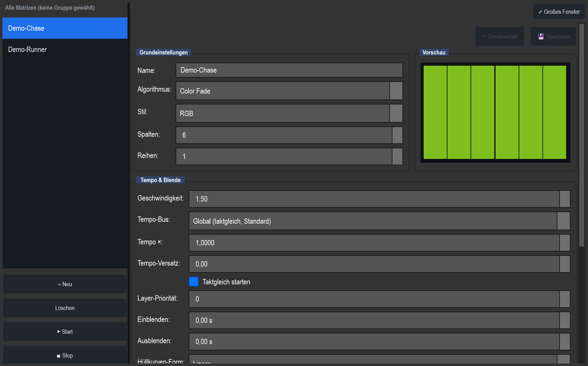

# RGB matrix editor

> **English version** of [RGB-Matrix-Editor](19_matrix_editor.md). LightOS itself speaks German: every button, menu and field is quoted here **exactly as it appears on screen**, with an English translation in brackets the first time it shows up. The screenshots are the same as in the German page.

> The large editor in which you create, set up and try out live matrix/pixel effects (chase, wave, rainbow, color fade …) for a group of fixtures.

## What it is for

An **RGB matrix** treats several fixtures as one **pixel grid** (columns × rows) and runs an effect across it – e.g. a chase from left to right, a wave, a rainbow or a slow crossfade between several colors. Instead of giving each fixture a color individually, you describe a **look** (algorithm + colors + tempo), and LightOS calculates the matching pixel for every fixture in the grid.

In LightOS a matrix is a **real function** (like a chaser or a scene). This means:

- It is written to DMX by the normal renderer and is immediately visible on stage.
- It appears in the **function library** and can be put on **VC buttons, faders and MIDI**.
- It is **saved with the show** just like everything else.

The editor is the workbench where you build and edit these looks.

## Where to find it

- **In the programmer:** the **„Matrix"** tab. There the matrix automatically follows your fixture selection (see "follow mode" below), so you program directly on the fixtures currently selected.
- **As its own sub-tab / manager:** the same interface, but with manual fixture assignment (buttons „Aus Auswahl" (from selection) and „Auto-Zuweisung aus Patch" (auto-assign from patch)).
- **As a large window:** the **„⤢ Großes Fenster"** (large window) button at the top right undocks the complete editor into a freely resizable, scrollable window (good when there are many settings). Tapping it again or closing the window docks it back.

Both views read the same function manager – a matrix you create in the programmer also appears in the manager, and vice versa.

## Layout & controls

The editor is split in two: on the left the **function list**, on the right the **editor body** in labeled groups.

### Left column – function list

| Element | Function |
|---|---|
| **List** | All existing matrix functions („Demo-Chase", „Demo-Runner" in the screenshot). The selected matrix is edited on the right. The name updates live as you type. |
| **+ Neu** (new) | Creates a new matrix (default 8 × 4) and selects it. |
| **Löschen** (delete) | Removes the selected matrix. A neighboring one is then selected automatically. |
| **▶ Start** | Starts the **saved** matrix (output runs, fixtures light up). |
| **■ Stop** | Stops the saved matrix. |

> Note: **Start/Stop** always act on the saved version, not on unsaved changes in the editor. Save first, then start.

### Right column – editor body

At the very top sits the **„⤢ Großes Fenster"** button. Below it is the **save bar**:

| Element | Function |
|---|---|
| **● ungespeicherte Änderungen** (unsaved changes) | Yellow hint that the draft differs from the saved state. |
| **💾 Speichern** (save) | Applies all editor fields to the real function (and reports this to the library). |
| **↩ Zurücksetzen** (reset) | Discards the draft and brings back the saved state. |

LightOS works with a **draft**: changes first land only in the draft and create the dirty state; only **Speichern** writes them into the running function. **Exception:** the fixture/grid assignment takes effect **live immediately** (no saving needed).

#### Group „Grundeinstellungen" (basic settings)

| Field | Meaning |
|---|---|
| **Name** | Display name in the list and the library. |
| **Algorithmus** (algorithm) | The effect type (see the section "Algorithms"). Changing it rebuilds the parameter fields below. |
| **Style** | RGB / RGBW / Dimmer / Shutter – determines which channels the matrix touches (see "Style & colors"). |
| **Spalten** (columns) | Grid width (1–64). |
| **Reihen** (rows) | Grid height (1–32). |

Next to it is the **„Vorschau"** (preview) group with the live LED grid: each cell is a pixel showing the current effect (red in the screenshot, because „Color Fade" is currently on the red color). **Gaps** in the fixture grid are deliberately drawn empty with a dotted border and a diagonal line – this way you can tell a genuinely dark LED from an unoccupied cell.

#### Group „Tempo & Blende" (tempo & fade)

| Field | Meaning |
|---|---|
| **Geschwindigkeit** (speed) | Animation rate in steps/s (0.01–20). The matrix's own speed, separate from the global speed master. |
| **Layer-Priorität** (layer priority) | −99 … 99. Higher priority wins when two effects write the same channel. Equal priority → the most recently started effect wins. |
| **Einblenden** (fade in) | Fade-in time on start, in seconds (0 = immediate). |
| **Ausblenden** (fade out) | Fade-out time on stop, in seconds (0 = immediate). |
| **Hüllkurven-Form** (envelope shape) | Shape of the fade-in/fade-out curve (linear, soft …). |

#### Group „Farben" (colors)

Depending on style and algorithm, it shows either fixed color buttons **C1/C2/C3**, a **color sequence editor**, or the range fields for dimmer/shutter. Details below under "Style & colors".

#### Group „Bewegung & Parameter" (movement & parameters)

| Element | Meaning |
|---|---|
| **Richtung** (direction) | Vorwärts / Rückwärts (forward / backward) (only for algorithms where a direction makes sense). |
| **dynamic fields** | Matching controls per algorithm – e.g. Achse (axis), Bewegung (movement), Läufer-Anzahl (runner count), Schweif (%) (trail), Strahlbreite (beam width), Spread … They rebuild automatically as soon as the algorithm, the style or a dependent value changes (only the parameters that actually have an effect appear). |

#### Group „Fixture-Grid"

| Element | Function |
|---|---|
| **Status line** | Shows e.g. „4 × 8 = 32 Fixtures, 0 Lücken (Gruppe »Bühne«)" (4 × 8 = 32 fixtures, 0 gaps (group »stage«)). |
| **Aus Auswahl** | Builds the grid from the fixtures selected on the left in the programmer – for a real group as a 2D grid including gaps, otherwise as 1 × N. |
| **Auto-Zuweisung aus Patch** | Fills the current grid with fixtures from the active selection/group (fallback: the whole patch). |

> In **follow mode** (programmer tab „Matrix") these buttons are hidden; the group is then called „Geräte (folgen der Programmer-Auswahl)" (fixtures (follow the programmer selection)) and takes over the selected group automatically.

## Algorithms

The algorithm determines the pattern. Many movement variants are now **parameters** instead of separate algorithms (e.g. „Chase Horizontal/Vertical/Diagonal" is simply Chase with the parameter *Achse*). Old shows are migrated automatically.

### Basic algorithms (with parameters)

| Algorithm | What it does | Important parameters |
|---|---|---|
| **Plain** | Whole area in C1 (static color). | – |
| **Chase** | Chase (running light). | Achse (H/V/Diag), Bewegung (normal/bounce/center_out/outside_in), Läufer-Anzahl & -Breite (runner count & width), **Schweif (%)** (spatial trail behind the runner), Farbe pro Runde wechseln (change color each round), Invertieren (invert) |
| **Wipe** | Wipes C1 over background C2. | Achse, Bewegung, Kanten-Fade (edge fade) |
| **Wave** | Wave with a selectable origin. | Ursprung (origin) (links/rechts/oben/unten/Mitte/radial = left/right/top/bottom/center/radial), Dichte (density), Breite (width) |
| **Gradient** | Scrolling color gradient across the color sequence. | Achse, Verlauf (gradient) (smooth/Bänder = smooth/bands) |
| **Rainbow** | Rainbow; generates its own colors (no color choice). | Bewegung (linear/radial/center_out/outside_in), Spread, Sättigung (saturation), Helligkeit (brightness) |
| **Fill** | Fills up the group step by step. | Füll-Modus (fill mode) (per style), Reihenfolge (order), Tempo, Fade, Halte-Zeit (hold time), Loop-Modus (loop mode) |
| **Random** | Random effect; the parameters depend on the style. | Modus (mode), aktive Fixtures (active fixtures), Rate, Auswahl (selection) (all/row/col), Wiederholschutz (repeat protection), Strobe-Rate |
| **Color Fade** | Crossfade through the whole color sequence (disabled colors are skipped). | Halte-Zeit, Ping-Pong |
| **Strobe** | The whole field flashes on/off (tempo = Geschwindigkeit). | – |
| **Schachbrett** (checkerboard) | Neighboring cells alternate between color A/B (e.g. red-blue or red-off). | Kachelgröße (tile size), „Pro Beat umschalten" (switch every beat) (alternating flash) |

### Textures / single looks

| Algorithm | What it does | Important parameters |
|---|---|---|
| **Radar** | Rotating radar beam in C1. | Strahlbreite, Schweif, Invertieren |
| **Spirale** (spiral) | Rotating spiral arm. | Windungen (turns), Armbreite (arm width), Invertieren |
| **Sine Plasma** | Soft sine plasma between C1 and C2. | – |
| **Windrad** (pinwheel) | Rotating segments alternating C1/C2. | Segmente (segments), Invertieren |
| **Atmen (Puls)** (breathing (pulse)) | The whole field pulses gently in C1. | – |
| **Feuer** (fire) | Flickering flame look C1 → C2. | – |
| **Regen** (rain) | Falling drops per column. | Schweif |

## Style & colors

The **style** is a **channel mask**: for each style, only the matching channels of the fixtures involved are written; all others stay untouched. This lets you layer several matrix effects without them overwriting each other.

| Style | What is written | Color UI |
|---|---|---|
| **RGB** | Red/green/blue channels. | Colors (C1–C3 or sequence) |
| **RGBW** | Like RGB, plus real white on the W channel (white share = min(R,G,B)). | Colors |
| **Dimmer** | Only the dimmer/intensity channel. The pixel brightness is mapped into the range Min…Max. **Color is switched off.** | Dimmer range (Min/Max) |
| **Shutter** | Only the shutter channel. The pixel brightness is mapped into the shutter range Min…Max. **Color is switched off.** | Shutter range (Min/Max) |

> **Important:** If you set the style to **Dimmer** or **Shutter**, the color selection disappears completely – the matrix then only controls brightness or the shutter. In the preview these styles are shown in greyscale.

### C1–C3 vs. color sequence

How many color fields appear depends on the algorithm – only the colors the effect actually evaluates are shown:

- **Fixed color buttons C1…Cn:** for algorithms with a fixed number of colors – e.g. Plain = 1, Wipe/Wave/Sine Plasma/Windrad = 2.
- **Color sequence editor:** for algorithms that use the **whole color list, of any length** – Gradient, Color Fade, Fill, Random, Schachbrett. Here you can add, remove and reorder colors and switch each one **active/inactive**. Disabled colors are kept, but fade/sequence effects skip them (good for switching live).
- **No color (0):** e.g. Rainbow generates its colors itself – then the color group is hidden.

Special case: **Chase with „Farbe pro Runde wechseln"** switches to the multi-color sequence so that the runner can run through several colors.

## Columns/rows & fixture grid

- **Spalten × Reihen** span the logical pixel grid.
- The **fixture grid** assigns a fixture to each cell (row-major). A cell can be a **gap** (no fixture): it exists spatially but never receives output – the effect still calculates across the full area, only this cell stays dark.
- **From a fixture group** with stored positions you get a real 2D grid including gaps; from a loose multiple selection you get a **1 × N** strip.
- Fixtures without RGB but with a **color wheel** are driven via the matching color wheel slot; fixtures with a **dimmer** keep their dimmer free if the matrix doesn't drive it itself (so they can be combined as a pure color layer).

## Tempo, fade & layer priority

- **Geschwindigkeit** drives the animation (steps/s). Via parameters, a matrix can additionally be synchronized to a **tempo bus** (Global/A–D), with a freely selectable **multiplier** (×0.5, ×2, ×3 …) and **offset in beats** – this way several effects run together exactly on the beat.
- **Einblenden/Ausblenden + Hüllkurven-Form** define the soft envelope on start/stop.
- **Layer-Priorität** decides which effect wins when channels collide – important when, for example, you put a color matrix and a dimmer matrix over the same fixtures.

## Live control from the VC

Because `_render` reads freshly from the fields on **every frame**, changes take effect immediately – which makes the matrix fully **live-programmable**. Through the parameter metadata (`mappable`, `live_editable`) the Virtual Console automatically knows what can be controlled. You put the matrix as a function on a VC widget and then control it, for example, like this:

| VC widget | Typical use |
|---|---|
| **Fader** | Brightness (effect master), speed, fill level, fade times or any effect parameter. |
| **Encoder / rotary knob** | Fine adjustment of individual parameters (Spread, Strahlbreite, Rate …). |
| **Stepper** | Step through algorithms or values („Form +/−" (shape +/−)). |
| **Effect colors widget** | Switch the color sequence live: next/previous color, add a color, on/off. |
| **Effect editor box** | Edit the whole effect directly in the VC. |
| **Chase list** | Shows the color sequence built live (the former *Chase-Builder* has been removed since 2026-06-30; the matrix itself is built into larger sequences via chasers/cue lists). |

Available **live actions** (can be put on buttons/MIDI): Farbe +/− (color +/−), +Farbe (+color), Farbe an/aus (color on/off), Form +/−, Richtung, Bounce, **Freeze** (freeze the animation), **Reset Live** (discard live changes), **Commit** (take over live values as a preset), **Tap** (tap the tempo).

## Tips & pitfalls

- **Don't forget to save:** editor changes only reach the running function after **💾 Speichern**. Start/Stop only act on the saved state. (The grid assignment is the only exception – it takes effect immediately.)
- **„Style = Dimmer/Shutter" switches color off.** If you want to program colors, you need the style **RGB** or **RGBW**.
- **No color fields visible?** Either the algorithm generates its own colors (Rainbow) or the style is Dimmer/Shutter.
- **Want a pure color layer?** Don't let the matrix drive the dimmer itself, and control the brightness via a separate fader/dimmer effect – thanks to the layer priority, the two layer cleanly.
- **Gaps are intentional:** An empty, dotted cell in the preview is not an error but an unoccupied grid position.
- **There are no dead controls:** Only parameters that actually have an effect in the current algorithm/style/mode appear (e.g. Strobe-Rate only in strobe mode, Läufer-Anzahl/Schweif (%) only with the Chase Bewegung „normal").
- Use **Großes Fenster** when the editor gets cramped in the narrow tab – same content, freely resizable.
- You only get a **real 2D grid** via a **fixture group with positions**; a loose selection always gives just a 1 × N strip.
