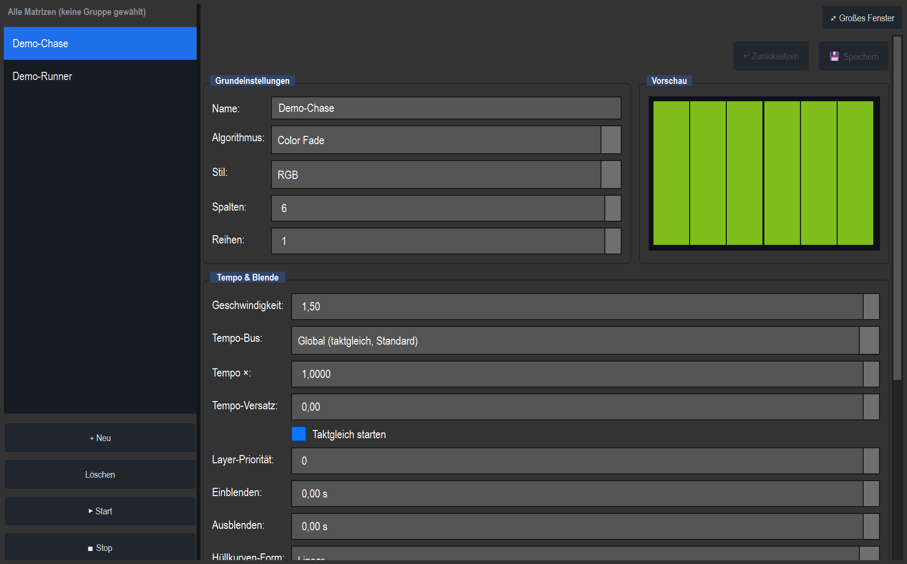

# RGB-Matrix-Editor

> Der große Editor, in dem du Matrix-/Pixel-Effekte (Lauflicht, Welle, Regenbogen, Color Fade …) für eine Gruppe von Geräten anlegst, einstellst und live ausprobierst.

## Wozu

Eine **RGB-Matrix** behandelt mehrere Geräte als ein **Pixel-Raster** (Spalten × Reihen) und schickt einen Effekt darüber – z. B. ein Lauflicht von links nach rechts, eine Welle, einen Regenbogen oder ein langsames Überblenden mehrerer Farben. Statt jedem Gerät einzeln eine Farbe zu geben, beschreibst du einen **Look** (Algorithmus + Farben + Tempo), und LightOS rechnet daraus für jedes Gerät im Raster den passenden Pixel aus.

Eine Matrix ist in LightOS eine **echte Funktion** (wie ein Chaser oder eine Szene). Das heißt:

- Sie wird im normalen Renderer ins DMX geschrieben und ist sofort auf der Bühne sichtbar.
- Sie erscheint in der **Funktions-Bibliothek** und lässt sich auf **VC-Buttons, Fader und MIDI** legen.
- Sie wird ganz normal **mit der Show gespeichert**.

Der Editor ist die Werkbank, an der du diese Looks baust und bearbeitest.

## Wo man ihn findet

- **Im Programmer:** Reiter **„Matrix"**. Dort folgt die Matrix automatisch deiner Geräte-Auswahl (siehe unten „Folge-Modus"), du programmierst also direkt an den gerade gewählten Geräten.
- **Als eigener Sub-Tab / Manager:** dieselbe Oberfläche, aber mit manueller Geräte-Zuweisung (Knöpfe „Aus Auswahl" und „Auto-Zuweisung aus Patch").
- **Als großes Fenster:** Knopf **„⤢ Großes Fenster"** oben rechts koppelt den kompletten Editor in ein frei vergrößerbares, scrollbares Fenster aus (gut bei vielen Einstellwerten). Erneut tippen oder Fenster schließen dockt ihn wieder an.

Beide Ansichten lesen denselben Funktions-Manager – eine Matrix, die du im Programmer anlegst, erscheint auch im Manager und umgekehrt.

## Aufbau & Bedienelemente

Der Editor ist zweigeteilt: links die **Funktionsliste**, rechts der **Editor-Körper** in beschrifteten Gruppen.

### Linke Spalte – Funktionsliste

| Element | Funktion |
|---|---|
| **Liste** | Alle vorhandenen Matrix-Funktionen (im Screenshot „Demo-Chase", „Demo-Runner"). Die markierte Matrix wird rechts bearbeitet. Der Name aktualisiert sich live beim Tippen. |
| **+ Neu** | Legt eine neue Matrix an (Standard 8 × 4) und wählt sie aus. |
| **Löschen** | Entfernt die markierte Matrix. Danach wird automatisch ein Nachbar gewählt. |
| **▶ Start** | Startet die **gespeicherte** Matrix (Output läuft, Geräte leuchten). |
| **■ Stop** | Stoppt die gespeicherte Matrix. |

> Hinweis: **Start/Stop** wirken immer auf die gespeicherte Fassung, nicht auf ungesicherte Änderungen im Editor. Erst speichern, dann starten.

### Rechte Spalte – Editor-Körper

Ganz oben sitzt der Knopf **„⤢ Großes Fenster"**. Darunter die **Speicher-Leiste**:

| Element | Funktion |
|---|---|
| **● ungespeicherte Änderungen** | Gelber Hinweis, dass der Entwurf vom gespeicherten Stand abweicht. |
| **💾 Speichern** | Übernimmt alle Editor-Felder in die echte Funktion (und meldet das an die Bibliothek). |
| **↩ Zurücksetzen** | Verwirft den Entwurf und holt den gespeicherten Stand zurück. |

LightOS arbeitet mit einem **Entwurf (Draft)**: Änderungen landen zuerst nur im Entwurf und erzeugen den Dirty-State; erst **Speichern** schreibt sie in die laufende Funktion. **Ausnahme:** die Geräte-/Grid-Zuweisung wirkt **sofort live** (kein Speichern nötig).

#### Gruppe „Grundeinstellungen"

| Feld | Bedeutung |
|---|---|
| **Name** | Anzeigename in Liste und Bibliothek. |
| **Algorithmus** | Der Effekt-Typ (siehe Abschnitt „Algorithmen"). Wechseln baut die Parameter-Felder darunter neu auf. |
| **Style** | RGB / RGBW / Dimmer / Shutter – bestimmt, welche Kanäle die Matrix anfasst (siehe „Style & Farben"). |
| **Spalten** | Raster-Breite (1–64). |
| **Reihen** | Raster-Höhe (1–32). |

Daneben liegt die Gruppe **„Vorschau"** mit dem Live-LED-Raster: Jede Zelle ist ein Pixel, das den aktuellen Effekt zeigt (im Screenshot rot, weil „Color Fade" gerade auf der roten Farbe steht). **Lücken** im Geräte-Grid werden bewusst leer mit gepunktetem Rahmen und Schräge gezeichnet – so unterscheidest du eine echte dunkle LED von einer unbelegten Zelle.

#### Gruppe „Tempo & Blende"

| Feld | Bedeutung |
|---|---|
| **Geschwindigkeit** | Animationsrate in Schritten/s (0,01–20). Eigene Matrix-Geschwindigkeit, getrennt vom globalen Speed-Master. |
| **Layer-Priorität** | −99 … 99. Höhere Priorität gewinnt, wenn zwei Effekte denselben Kanal schreiben. Gleiche Priorität → der zuletzt gestartete Effekt gewinnt. |
| **Einblenden** | Einblendzeit beim Start in Sekunden (0 = sofort). |
| **Ausblenden** | Ausblendzeit beim Stoppen in Sekunden (0 = sofort). |
| **Hüllkurven-Form** | Form der Ein-/Ausblendkurve (linear, weich …). |

#### Gruppe „Farben"

Zeigt – abhängig von Style und Algorithmus – entweder feste Farbknöpfe **C1/C2/C3**, einen **Color-Sequence-Editor**, oder die Bereichsfelder für Dimmer/Shutter. Details unten unter „Style & Farben".

#### Gruppe „Bewegung & Parameter"

| Element | Bedeutung |
|---|---|
| **Richtung** | Vorwärts / Rückwärts (nur bei Algorithmen, für die Richtung sinnvoll ist). |
| **dynamische Felder** | Je Algorithmus passende Regler – z. B. Achse, Bewegung, Läufer-Anzahl, Schweif (%), Strahlbreite, Spread … Sie bauen sich automatisch neu auf, sobald sich Algorithmus, Style oder ein abhängiger Wert ändert (es erscheinen nur die Parameter, die wirklich wirken). |

#### Gruppe „Fixture-Grid"

| Element | Funktion |
|---|---|
| **Statuszeile** | Zeigt z. B. „4 × 8 = 32 Fixtures, 0 Lücken (Gruppe »Bühne«)". |
| **Aus Auswahl** | Bildet das Grid aus den links im Programmer gewählten Geräten – bei einer echten Gruppe als 2D-Raster inkl. Lücken, sonst als 1 × N. |
| **Auto-Zuweisung aus Patch** | Füllt das aktuelle Raster mit Geräten der aktiven Auswahl/Gruppe (Fallback: ganzer Patch). |

> Im **Folge-Modus** (Programmer-Reiter „Matrix") sind diese Knöpfe ausgeblendet; die Gruppe heißt dann „Geräte (folgen der Programmer-Auswahl)" und übernimmt die gewählte Gruppe automatisch.

## Algorithmen

Der Algorithmus bestimmt das Muster. Viele Bewegungsvarianten sind heute **Parameter** statt eigener Algorithmen (z. B. ist „Chase Horizontal/Vertical/Diagonal" einfach Chase mit Parameter *Achse*). Alte Shows werden automatisch migriert.

### Grund-Algorithmen (mit Parametern)

| Algorithmus | Was er macht | Wichtige Parameter |
|---|---|---|
| **Plain** | Volle Fläche in C1 (Standfarbe). | – |
| **Chase** | Lauflicht. | Achse (H/V/Diag), Bewegung (normal/bounce/center_out/outside_in), Läufer-Anzahl & -Breite, **Schweif (%)** (räumlicher Nachfaden hinter dem Läufer), Farbe pro Runde wechseln, Invertieren |
| **Wipe** | Wischt C1 über Hintergrund C2. | Achse, Bewegung, Kanten-Fade |
| **Wave** | Welle mit wählbarem Ursprung. | Ursprung (links/rechts/oben/unten/Mitte/radial), Dichte, Breite |
| **Gradient** | Scrollender Farbverlauf über die Color-Sequence. | Achse, Verlauf (smooth/Bänder) |
| **Rainbow** | Regenbogen, erzeugt eigene Farben (keine Farbwahl). | Bewegung (linear/radial/center_out/outside_in), Spread, Sättigung, Helligkeit |
| **Fill** | Füllt die Gruppe Schritt für Schritt auf. | Füll-Modus (je Style), Reihenfolge, Tempo, Fade, Halte-Zeit, Loop-Modus |
| **Random** | Zufallseffekt; Parameter richten sich nach dem Style. | Modus, aktive Fixtures, Rate, Auswahl (all/row/col), Wiederholschutz, Strobe-Rate |
| **Color Fade** | Crossfade durch die ganze Color-Sequence (deaktivierte Farben übersprungen). | Halte-Zeit, Ping-Pong |
| **Strobe** | Ganzes Feld blitzt an/aus (Tempo = Geschwindigkeit). | – |
| **Schachbrett** | Benachbarte Zellen abwechselnd Farbe A/B (z. B. rot-blau oder rot-aus). | Kachelgröße, „Pro Beat umschalten" (Wechsellicht) |

### Texturen / Einzel-Looks

| Algorithmus | Was er macht | Wichtige Parameter |
|---|---|---|
| **Radar** | Rotierender Radarstrahl in C1. | Strahlbreite, Schweif, Invertieren |
| **Spirale** | Rotierender Spiralarm. | Windungen, Armbreite, Invertieren |
| **Sine Plasma** | Weiches Sinus-Plasma zwischen C1 und C2. | – |
| **Windrad** | Rotierende Segmente abwechselnd C1/C2. | Segmente, Invertieren |
| **Atmen (Puls)** | Ganzes Feld pulsiert sanft in C1. | – |
| **Feuer** | Flackernder Flammen-Look C1 → C2. | – |
| **Regen** | Fallende Tropfen je Spalte. | Schweif |

## Style & Farben

Der **Style** ist eine **Kanalmaske**: Je Style werden nur die passenden Kanäle der beteiligten Geräte geschrieben, alle anderen bleiben unangetastet. So lassen sich mehrere Matrix-Effekte überlagern, ohne sich zu überschreiben.

| Style | Was geschrieben wird | Farb-UI |
|---|---|---|
| **RGB** | Rot/Grün/Blau-Kanäle. | Farben (C1–C3 bzw. Sequence) |
| **RGBW** | Wie RGB, plus echtes Weiß auf dem W-Kanal (Weißanteil = min(R,G,B)). | Farben |
| **Dimmer** | Nur Dimmer-/Intensitäts-Kanal. Die Pixel-Helligkeit wird in den Bereich Min…Max gemappt. **Farbe ist abgeschaltet.** | Dimmer-Bereich (Min/Max) |
| **Shutter** | Nur Shutter-Kanal. Pixel-Helligkeit wird in den Shutter-Bereich Min…Max gemappt. **Farbe ist abgeschaltet.** | Shutter-Bereich (Min/Max) |

> **Wichtig:** Stellst du den Style auf **Dimmer** oder **Shutter**, verschwindet die Farbwahl komplett – die Matrix steuert dann nur Helligkeit bzw. Verschluss. In der Vorschau werden diese Styles als Graustufen dargestellt.

### C1–C3 vs. Color-Sequence

Wie viele Farbfelder erscheinen, hängt vom Algorithmus ab – es werden nur die Farben gezeigt, die der Effekt wirklich auswertet:

- **Feste Farbknöpfe C1…Cn:** für Algorithmen mit fester Farbzahl – z. B. Plain = 1, Wipe/Wave/Sine Plasma/Windrad = 2.
- **Color-Sequence-Editor:** für Algorithmen, die die **ganze, beliebig lange Farbliste** nutzen – Gradient, Color Fade, Fill, Random, Schachbrett. Hier kannst du Farben hinzufügen, entfernen, umsortieren und einzeln **aktiv/inaktiv** schalten. Deaktivierte Farben bleiben erhalten, werden aber von Fade-/Sequence-Effekten übersprungen (gut für Live-Umschalten).
- **Keine Farbe (0):** z. B. Rainbow erzeugt seine Farben selbst – dann ist die Farbgruppe ausgeblendet.

Sonderfall: **Chase mit „Farbe pro Runde wechseln"** schaltet auf die Multi-Color-Sequence um, damit der Läufer durch mehrere Farben laufen kann.

## Spalten/Reihen & Geräte-Grid

- **Spalten × Reihen** spannen das logische Pixel-Raster auf.
- Das **Fixture-Grid** ordnet jeder Zelle ein Gerät zu (row-major). Eine Zelle kann eine **Lücke** (kein Gerät) sein: räumlich vorhanden, bekommt aber nie Output – der Effekt rechnet trotzdem über die volle Fläche, nur diese Zelle bleibt dunkel.
- **Aus einer Gerätegruppe** mit hinterlegten Positionen entsteht ein echtes 2D-Grid inklusive Lücken; aus einer losen Mehrfachauswahl entsteht ein **1 × N**-Streifen.
- Geräte ohne RGB, aber mit **Farbrad**, werden über den passenden Farbrad-Slot angesteuert; Geräte mit **Dimmer** behalten ihren Dimmer frei, wenn die Matrix ihn nicht selbst treibt (so kombinierbar als reine Farb-Ebene).

## Tempo, Blende & Layer-Priorität

- **Geschwindigkeit** treibt die Animation (Schritte/s). Über Parameter lässt sich eine Matrix zusätzlich auf einen **Tempo-Bus** (Global/A–D) synchronisieren, mit frei wählbarem **Multiplikator** (×0,5, ×2, ×3 …) und **Versatz in Beats** – so laufen mehrere Effekte taktgenau zusammen.
- **Einblenden/Ausblenden + Hüllkurven-Form** definieren die weiche Hüllkurve beim Start/Stopp.
- **Layer-Priorität** entscheidet bei Kanal-Kollisionen, welcher Effekt gewinnt – wichtig, wenn du z. B. eine Farb-Matrix und eine Dimmer-Matrix über dieselben Geräte legst.

## Live-Steuerung aus der VC

Weil `_render` bei **jedem Frame** frisch aus den Feldern liest, wirken Änderungen sofort – die Matrix ist damit voll **live-programmierbar**. Über die Parameter-Metadaten (`mappable`, `live_editable`) weiß die Virtuelle Konsole automatisch, was steuerbar ist. Du legst die Matrix als Funktion auf ein VC-Widget und steuerst sie dann z. B. so:

| VC-Widget | Typischer Einsatz |
|---|---|
| **Fader** | Helligkeit (Effekt-Master), Geschwindigkeit, Füll-Level, Fade-Zeiten oder beliebigen Effekt-Parameter. |
| **Encoder / Drehregler** | Feinjustage einzelner Parameter (Spread, Strahlbreite, Rate …). |
| **Stepper** | Durch Algorithmen oder Werte schalten („Form +/−"). |
| **Effekt-Farben-Widget** | Farb-Sequence live umschalten: nächste/vorige Farbe, Farbe hinzufügen, an/aus. |
| **Effekt-Editor-Box** | Den ganzen Effekt direkt in der VC bearbeiten. |
| **Chase-Builder** | Matrix als Schritt in eine größere Abfolge einbauen. |

Verfügbare **Live-Aktionen** (auf Buttons/MIDI legbar): Farbe +/−, +Farbe, Farbe an/aus, Form +/−, Richtung, Bounce, **Freeze** (Animation einfrieren), **Reset Live** (Live-Änderungen verwerfen), **Commit** (Live-Werte als Preset übernehmen), **Tap** (Tempo tappen).

## Tipps & Fallen

- **Speichern nicht vergessen:** Editor-Änderungen sind erst nach **💾 Speichern** in der laufenden Funktion. Start/Stop wirken nur auf den gespeicherten Stand. (Die Grid-Zuweisung ist die einzige Ausnahme – sie greift sofort.)
- **„Style = Dimmer/Shutter" schaltet Farbe ab.** Wer Farben programmieren will, braucht Style **RGB** oder **RGBW**.
- **Keine Farbfelder sichtbar?** Entweder erzeugt der Algorithmus eigene Farben (Rainbow) oder der Style ist Dimmer/Shutter.
- **Reine Farb-Ebene gewünscht?** Lass die Matrix den Dimmer nicht selbst treiben und steuere die Helligkeit über einen separaten Fader/Dimmer-Effekt – dank Layer-Priorität überlagern sich beide sauber.
- **Lücken sind gewollt:** Eine leere, gepunktete Zelle in der Vorschau ist kein Fehler, sondern eine unbelegte Grid-Position.
- **Tote Regler gibt es nicht:** Es erscheinen nur Parameter, die im aktuellen Algorithmus/Style/Modus auch wirken (z. B. Strobe-Rate nur im Strobe-Modus, Läufer-Anzahl/Schweif (%) nur bei Chase-Bewegung „normal").
- **Großes Fenster** nutzen, wenn der Editor im schmalen Tab eng wird – derselbe Inhalt, frei vergrößerbar.
- **Echtes 2D-Raster** bekommst du nur über eine **Gerätegruppe mit Positionen**; lose Auswahl ergibt immer nur einen 1 × N-Streifen.
