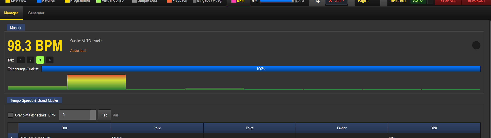

# BPM-Manager (Tempo-Erkennung & -Verwaltung)

> Der eigene **BPM**-Tab, in dem LightOS das globale Tempo erkennt, anzeigt und verwaltet — die zentrale Stelle, von der alle tempo-gebundenen Effekte ihren Takt holen.

## Wozu

Sehr viele Dinge in LightOS laufen „auf den Takt": pulsierende Farben, Strobe, Chaser-Schritte, EFX-Geschwindigkeit, BPM-gekoppelte Fader in der Virtuellen Konsole. Damit das funktioniert, braucht es **eine** verlässliche, globale BPM-Zahl. Der BPM-Manager ist genau diese eine Quelle:

- Er **erkennt** das Tempo automatisch aus der Musik (Audio-Analyse) — oder
- du **gibst es manuell** vor (Tap, Nudge, Lock), wenn die Automatik mal danebenliegt, und
- er **verwaltet** zusätzliche Tempo-Buses (z. B. „Bass läuft halb so schnell wie Drums"), an die du einzelne Effekte koppeln kannst.

Kurz: Der Manager ist der **Tempo-Leader** der Show. Alles, was „im Takt" laufen soll, hört auf ihn.

## Wo man ihn findet (Tab „BPM"; Reiter „Manager"/„Generator")

In der oberen Tab-Leiste auf **BPM** klicken. Der Tab hat zwei Reiter:

| Reiter | Inhalt |
|---|---|
| **Manager** | Live-Erkennung & Verwaltung — das ist diese Seite. |
| **Generator** | Ein ganzes Lied vorab analysieren und ein Beatgrid erzeugen (siehe unten). |

In der globalen Kopfzeile (oben rechts) siehst du außerdem dauerhaft die aktuelle **BPM-Zahl**, den Modus (**AUTO**) und einen **TAP**-Knopf — die spiegeln denselben Zustand wie dieser Tab.

## Monitor (BPM-Anzeige, Takt, Erkennungs-Qualität)

Der oberste Kasten **Monitor** zeigt live, was die Erkennung gerade macht:

| Element | Bedeutung |
|---|---|
| **Große BPM-Zahl** (gelb, z. B. „98.3 BPM") | Das aktuell gültige globale Tempo. Steht hier `-- BPM` (grau), ist gerade keine BPM aktiv. |
| **Quelle: …** | Woher die BPM gerade kommt, z. B. „AUTO · Audio", „OS2L (extern)", „MANUAL · Tap", „AUTO · Datei/Player". |
| **Status-Zeile** (orange) | Zustand des Audio-Eingangs: „Audio läuft", „Audio gestoppt" oder eine Warnung „⚠ …" bei einem Eingangs-Fehler. |
| **Beat-Punkt** (Kreis rechts) | Blinkt auf jeden Schlag — gelb auf der **Eins** (Downbeat), grün auf den übrigen Schlägen. Sicht-Check, ob der Beat sitzt. |
| **Takt: 1 2 3 4 …** | Die Zellen leuchten reihum mit; die gelbe Zelle ist die **Eins**. Die Anzahl der Zellen folgt der Einstellung *Beats/Takt*. Bei sehr vielen Schlägen pro Takt (>16) steht rechts zusätzlich die genaue Position als „n / N". |
| **Erkennungs-Qualität** (Balken) | Confidence der Beat-Erkennung in Prozent. Hoch = stabile, sichere Erkennung; niedrig = unsicher (leiser/komplexer Track, falsche Grenzen). |
| **Spektrum** (Bargraph) | Live-Frequenzanzeige des Eingangssignals — nützlich, um zu sehen, ob überhaupt Audio ankommt und wo die Energie liegt. |

## BPM-Quelle, Lock & Audio-Eingang

Im Kasten **Einstellungen** legst du oben fest, **wie** und **woraus** das Tempo bestimmt wird.

### BPM-Quelle & Lock

Ganz oben der Umschalter **BPM-Quelle:** — er legt fest, **woraus** das Tempo kommt. Genau eine Option ist aktiv:

| Option | Wirkung |
|---|---|
| **Live-Audio** | Die BPM wird live aus dem Audio-Eingang erkannt (Standard, „läuft von selbst mit"). Welcher Eingang das speist, stellst du unten unter *Audio-Eingang* ein (PC-Audio / Externer Eingang / OS2L). |
| **Lied-Analyse** | Die BPM folgt der Offline-Analyse eines geladenen Songs (aus dem Generator-Tab). Das Feld **Analyse-Song** daneben wählt, welcher analysierte Song das Tempo treibt. |
| **Manuell / Tap** | Die Automatik treibt nicht mehr; das Tempo kommt nur noch aus **Tap/Nudge/Eingabe**. |
| **🔒 BPM einfrieren** (Lock, Umschalt-Knopf) | **Friert die aktuelle BPM ein.** Die Quellen ändern sie nicht mehr, bis du Lock wieder löst. Praktisch, wenn die Erkennung gut sitzt und du sie für einen Übergang festhalten willst. |

> Intern fasst LightOS „Live-Audio/Lied-Analyse" als **AUTO** und „Manuell / Tap" als **MANUAL** zusammen. Dieses Kürzel siehst du nur noch als **Badge in der globalen Kopfzeile** (Klick dort schaltet AUTO/MANUAL um) — einen eigenen AUTO/MANUAL-Schalter gibt es im Einstellungen-Kasten nicht mehr.

**Präzedenz (wer gewinnt):** **Manuell / Tap / Lock** überstimmen alles → darunter **Live-Audio** → darunter **Lied-Analyse/OS2L** als Fallback. Es gibt immer **genau eine** Beat-Quelle gleichzeitig.

### Genre-Preset

Unter **BPM-Quelle** und **Analyse-Song** eine Auswahlliste **Genre-Preset** + Knopf **Anwenden**. Wählst du ein Genre (z. B. House, Drum&Bass) und klickst *Anwenden*, stellt LightOS in einem Rutsch die passenden **Tempo-Grenzen, Empfindlichkeit, Glättung und das Takt-Raster** ein. Bequemer Startpunkt, den du danach noch von Hand nachjustieren kannst.

### Audio-Eingang

Nur bei *BPM-Quelle = Live-Audio*: welcher Eingang die Erkennung speist:

| Quelle | Bedeutung |
|---|---|
| **PC-Audio (Player/Spotify)** | Loopback — LightOS hört intern mit, was am PC läuft (eingebauter Player, Spotify, Browser …). Kein Verkabeln nötig. |
| **Externer Eingang** | Ein echtes Eingangsgerät (Mikrofon/Line-In/Interface). Das **Geräte-Auswahlfeld** daneben wird dann aktiv — dort das richtige Eingangsgerät wählen. |
| **OS2L (VirtualDJ)** | Tempo & Beats kommen extern von einem OS2L-Sender (z. B. VirtualDJ). LightOS startet dafür seinen OS2L-Server und schaltet die eigene Audio-Analyse als Treiber ab. |

Beim Wechsel auf eine Audio-Quelle stoppt LightOS automatisch einen evtl. laufenden OS2L-Server, damit nicht zwei AUTO-Quellen um die BPM konkurrieren.

## Erkennung feineinstellen (Grenzen, Empfindlichkeit, Glättung, Takt-Raster)

Darunter die Regler, mit denen du die Automatik schärfst:

| Bedienelement | Wirkung | Tipp |
|---|---|---|
| **Grenzen (BPM) — Tiefen / Höhen** | Unteres und oberes BPM-Limit der Erkennung. Werte außerhalb werden verworfen bzw. verdoppelt/halbiert. | Eng setzen hilft gegen „halbes/doppeltes Tempo". Für 4-on-the-floor z. B. ~120–135. |
| **Empfindlichkeit** (Schieber) | Wie leicht ein Schlag als Beat zählt (0.50–3.00). Höher = reagiert auf schwächere Transienten. | Zu hoch → Fehl-Beats bei leisen Stellen; zu niedrig → springt verloren. |
| **Glättung** (Schieber) | Wie stark neue Messwerte gemittelt werden (0–1). Höher = ruhigere, trägere BPM-Zahl. | Hoch für stabile Sets, niedriger, wenn das Tempo schnell wechselt. |
| **Takt-Raster — Beats/Takt** | Schläge pro Takt; alle N Beats ist ein Downbeat (die „Eins"). Schnellknöpfe **4 / 8 / 16**. | 4 = normaler Viervierteltakt. Ändert **nicht** die Beat-Rate, nur, wo die Eins liegt. |
| **Takt-Raster — Unterteilung** | Zusatz-Ticks pro Beat („aus", 1/2 … 1/16) für schnellere Effekte. | Wirkt nur in Timer-/Tap-/Datei-Modus; bei Live-Audio gilt nur die Beat-Rate. |
| **Manuell — TAP** | Tempo mit der Maus/Hotkey einklopfen (Mittel über die letzten Taps). | Schnellste Rettung, wenn die Automatik daneben liegt — schaltet auf MANUAL. |
| **Manuell — Nudge (-10 … +10)** | Korrigiert die BPM in festen Schritten nach oben/unten. | Zum Feintrimmen, wenn der Wert fast passt. |

Alle Einstellungen werden gespeichert und beim nächsten Start wieder geladen.

## Tempo-Buses & Grand-Master (Master/Sub, Folgt, Faktor — wie Effekt-Tempi koppeln)

Der mittlere Kasten **Tempo-Speeds & Grand-Master** verwaltet **mehrere** benannte Tempo-Spuren („Buses"), an die du einzelne Effekte hängen kannst — statt dass alles starr auf der einen Sound-BPM läuft.

**Begriffe:**

- **Default (Sound-BPM)** — der Basis-Bus. Trägt das erkannte/eingestellte Haupttempo. Lässt sich nicht löschen.
- **Master** — ein eigener, benannter Tempo-Bus (z. B. „Bass", „Drums"), den du frei vergeben kannst.
- **Sub** — ein abgeleiteter Bus, der **einem anderen folgt** und dessen Tempo mit einem **Faktor** multipliziert (z. B. „½×" = halb so schnell).

### Die Tabelle

| Spalte | Bedeutung |
|---|---|
| **Bus** | Name des Buses (oben „Default (Sound-BPM)"). |
| **Rolle** | Master oder Sub. |
| **Folgt** | Bei Subs: welchem Bus er folgt (bzw. „Sound-BPM"). Bei Mastern „—". |
| **Faktor** | Bei Subs der Multiplikator (¼ · ½ · 1× · 2× · 4× …). Bei Mastern „—". |
| **BPM** | Das daraus resultierende aktuelle Tempo des Buses. |

### Anlegen / Bearbeiten / Löschen

1. Unten Namen ins Feld **„Neuer Master-Name"** eingeben und **Master anlegen** klicken.
2. Bus in der Tabelle anklicken — die Editor-Zeile darunter füllt sich. Dort:
   - **Rolle** auf *Master* oder *Sub* stellen,
   - bei Sub unter **Folgt** den Eltern-Bus und unter **Faktor** den Multiplikator wählen,
   - mit **Übernehmen** speichern.
3. **Löschen** entfernt den gewählten Bus (außer Default). **Aktualisieren** lädt die Tabelle neu.

### Grand-Master

Die oberste Zeile ist der **Grand-Master** — ein übergeordnetes Tempo, das **alle Master überstimmt**, wenn es scharf ist:

| Bedienelement | Wirkung |
|---|---|
| **Grand-Master scharf** (Häkchen) | Aktiviert: **alle** Master laufen auf dem Grand-Master-Takt (Subs bleiben relativ zu ihrem Master). |
| **BPM** (Eingabe) | Das Grand-Master-Tempo (0 = aus). |
| **Tap** | Den Grand-Master-Takt einklopfen. |
| **Status** (aus/scharf) | Grün „scharf", wenn aktiv und BPM > 0; sonst grau „aus". |

So koppelst du z. B. für einen Drop blitzartig **alle** Effekt-Tempi auf einen Wert, ohne jeden Bus einzeln anzufassen.

## Generator-Reiter (kurz)

Der zweite Reiter **Generator** analysiert ein **komplettes Lied vorab** statt live:

1. **Datei wählen** (Audiodatei), **Genre** und **Analyse-Engine** auswählen (Eingebaut/numpy, librosa, Beat This! — nicht installierte fallen sauber auf die eingebaute Engine zurück).
2. **Analysieren** dekodiert den Track und erzeugt eine **BPM-Kurve** + ein phasen-genaues **Beatgrid** (geplottet mit Zeitachse).
3. Das Grid lässt sich wie bei VirtualDJ/Serato **korrigieren**: ½×/2×, nudgen, **Downbeat per Klick** im Plot setzen.
4. **„Im Player laden & als BPM-Quelle nutzen"** macht die Analyse zur BPM-Quelle: beim Abspielen folgt die globale BPM dann dem Lied über die Zeit. Alternativ **als .json exportieren**.

Damit bekommst du auch bei tempo-wechselnden oder schwer erkennbaren Tracks ein sauberes, vorab geprüftes Tempo.

## Bezug zur VC (Widgets BPM-Anzeige, Tempo-Bus, Speed-Dial, Fader im BPM-Modus)

Die hier verwaltete BPM ist global — die Virtuelle Konsole greift direkt darauf zu:

- **BPM-Anzeige-Widget** — spiegelt die große BPM-Zahl/den Beat in deine VC-Seite.
- **Tempo-Bus-Widget** — wählt aus, **welchem Bus** (Default/Master/Sub) ein Bereich folgen soll; so steuerst du, dass z. B. ein Effekt auf „½×" läuft.
- **Speed-Dial** — regelt die Geschwindigkeit eines tempo-gebundenen Effekts relativ zum Bus.
- **Fader im BPM-Modus** — ein Fader, der nicht einen DMX-Wert, sondern ein **Tempo/eine Rate** vorgibt; setzt damit (im MANUAL-Sinn) die BPM bzw. den Bus-Faktor.

Faustregel: **Hier** (Manager) bestimmst du die Quelle und die Buses, **in der VC** holst du dir Anzeige und Live-Zugriff während der Show.

## Tipps & Fallen

- **Halbes/doppeltes Tempo?** Fast immer ein Grenzen-Problem. Setze *Tiefen/Höhen* enger um den erwarteten Bereich, dann verschwindet das Verdoppeln/Halbieren.
- **Erkennung springt:** Empfindlichkeit etwas runter und Glättung etwas hoch — oder gleich ein passendes **Genre-Preset** anwenden.
- **Sitzt der Beat, aber soll bleiben?** **🔒 Lock** drücken, bevor du in eine ruhige/breakige Passage gehst.
- **Automatik liegt komplett daneben:** auf **MANUAL** gehen und **TAP** — sicherer als gegen die Erkennung anzukämpfen. Mit **Nudge** feinjustieren.
- **Nur eine AUTO-Quelle:** OS2L und Audio-Analyse schließen sich aus. Beim Wechsel stoppt LightOS die jeweils andere automatisch — wundere dich nicht, wenn beim Umschalten kurz nichts erkannt wird.
- **„Externer Eingang" ohne Ton?** Prüfe das **Geräte-Auswahlfeld** rechts daneben (richtiges Eingangsgerät) und die Status-Zeile im Monitor („⚠ …").
- **Unterteilung wirkt nicht bei Live-Audio:** Sub-Ticks (1/2, 1/4 …) gelten nur in Timer-/Tap-/Datei-Modus; bei Live-Mithören taktet nur die erkannte Beat-Rate.
- **Grand-Master nicht vergessen zu entschärfen:** Solange „scharf", ignorieren alle Master ihr eigenes Tempo. Häkchen wieder weg, wenn die Buses wieder eigenständig laufen sollen.
