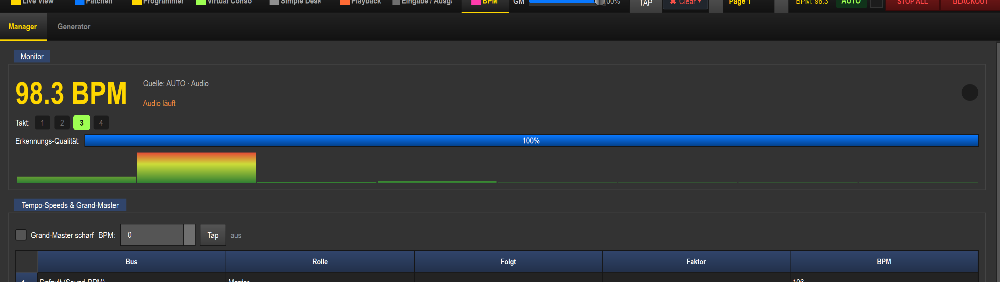

# BPM-Manager (Tempo-Erkennung & -Verwaltung)

> Der eigene **BPM**-Tab, in dem LightOS das globale Tempo erkennt, anzeigt und verwaltet — die zentrale Stelle, von der alle tempo-gebundenen Effekte ihren Takt holen.

## Wozu

Sehr viele Dinge in LightOS laufen „auf den Takt": pulsierende Farben, Strobe, Chaser-Schritte, EFX-Geschwindigkeit, BPM-gekoppelte Fader in der Virtuellen Konsole. Damit das funktioniert, braucht es **eine** verlässliche, globale BPM-Zahl. Der BPM-Manager ist genau diese eine Quelle:

- Er **erkennt** das Tempo automatisch aus der Musik (Audio-Analyse) — oder
- du **gibst es manuell** vor (Tap, Nudge, Lock), wenn die Automatik mal danebenliegt, und
- er **verwaltet** zusätzliche Tempo-Buses (z. B. „Bass läuft halb so schnell wie Drums"), an die du einzelne Effekte koppeln kannst.

Kurz: Der Manager ist der **Tempo-Leader** der Show. Alles, was „im Takt" laufen soll, hört auf ihn.

## Wo man ihn findet (Tab „BPM"; Reiter „Erkennung" / „Tempo-Buses" / „Generator")

In der oberen Tab-Leiste auf **BPM** klicken. Der Tab hat drei Reiter:

| Reiter | Inhalt |
|---|---|
| **Erkennung** | Live-Erkennung — das ist diese Seite (bis 2026-09-14 „Manager"). |
| **Tempo-Buses** | Tempo-Speeds, Grand-Master, Effekte je Bus (seit 2026-09-14 eigener Reiter). |
| **Generator** | Ein ganzes Lied vorab analysieren und ein Beatgrid erzeugen (siehe unten). |

In der globalen Kopfzeile (oben rechts) siehst du außerdem dauerhaft die aktuelle **BPM-Zahl**, den Modus (**AUTO**) und einen **TAP**-Knopf — die spiegeln denselben Zustand wie dieser Tab.

## Anzeigen (BPM-Zahl, Beat-Punkt, Zustandswort, Konfidenz)

Oben zeigt der Sub-Tab live, was die Erkennung gerade macht:

| Element | Bedeutung |
|---|---|
| **Große BPM-Zahl** (z. B. „98.3") | Das aktuell gültige globale Tempo. Gelb = Auto, grün = Manuell; `--` (grau) = gerade keine BPM aktiv. |
| **Beat-Punkt** (Kreis) | Blinkt auf jeden Schlag — gold auf der **Eins** (Downbeat), grün auf den übrigen Schlägen. Sicht-Check, ob der Beat sitzt; blinkt er neben der Musik: einmal **TAP**. |
| **Takt: 1 2 3 4 …** | Die Zellen leuchten reihum mit; die gelbe Zelle ist die **Eins**. Die Anzahl der Zellen folgt *Beats/Takt* (Erweitert). Bei sehr vielen Schlägen pro Takt (>16) steht rechts zusätzlich die genaue Position als „n / N". |
| **Zustandswort** | **KEIN SIGNAL** (nichts zu hören), **SUCHT** (Analysefenster füllt sich, ~4 s), **EINGERASTET** (Beats laufen), **PAUSE · hält N** (Stille, Tempo wird gehalten), **MANUELL**, **OS2L · wartet auf DJ-Software**, **LIED-ANALYSE**, **AUS**. Daneben, wer die BPM zuletzt gesetzt hat („· Audio", „· Tap", „· Lied-Analyse", „· OS2L (extern)") und ob **🔒** eingefroren ist. |
| **Konfidenz** (Balken) | Wie sicher die Erkennung ist, in Prozent. Hoch = stabiler Beat; niedrig = unsicher (leiser/komplexer Track, Pause, Sprache). |
| **Status-Zeile** (orange) | Nur bei einem Eingangs-Fehler: „⚠ …". |
| **Spektrum** (Bargraph) | Live-Frequenzanzeige des Eingangssignals — nützlich, um zu sehen, ob überhaupt Audio ankommt und wo die Energie liegt. |

## Quelle, TAP, Auto | Manuell, ×½ / ×2 (Sub-Tab „Erkennung", seit 2026-09-14)

Der Sub-Tab **Erkennung** zeigt ohne Klick genau **sechs Bedienelemente**; alles Weitere steckt hinter **▸ Erweitert**.

| Element | Wirkung |
|---|---|
| **Quelle** (Liste) | Woher das Tempo kommt: **PC-Audio** (Loopback — LightOS hört mit, was am PC läuft: Player, Spotify, Browser), **Eingang: <Gerät>** (je Mikrofon/Line-In/Interface ein Eintrag; die Liste liest die Geräte beim Öffnen neu), **OS2L (DJ-Software)** (Tempo & Beats kommen von VirtualDJ/Mixxx; LightOS startet seinen OS2L-Server und schaltet die eigene Audio-Analyse ab), **Lied-Analyse (Player)** (folgt dem Beatgrid des im Player geladenen, analysierten Titels), **Aus**. |
| **TAP** (großer Knopf) | *Einmal* tippen = Beat-Punkt auf „jetzt" (Tempo bleibt). *Drei-, viermal im Takt* = Tempo setzen, die Erkennung sucht um dieses Tempo. Derselbe Knopf wie **TAP** in der Kopfzeile. |
| **Auto \| Manuell** | **Auto:** das Tempo folgt der Quelle. **Manuell:** das Tempo bleibt, wie du es per TAP/Nudge setzt; die Quelle läuft im Hintergrund weiter. Das Badge **AUTO/MANUAL** in der Kopfzeile spiegelt denselben Zustand. |
| **×½ / ×2** | Halb-/Doppeltempo mit einem Klick — in Auto als Oktav-Vorgabe an die Erkennung, in Manuell direkt am Tempo. |
| **▸ Erweitert** | Tempo-Bereich von/bis + **Vorlage ▾** (Genre-Bereiche), Beats/Takt, Beat-Latenz (ms), **🔒 Tempo einfrieren**, Nudge −5/−1/+1/+5, Taktgenau, dazu Diagnosezeile und Spektrum. |

> **Zustandswort** neben dem Beat-Punkt: **KEIN SIGNAL** / **SUCHT** / **EINGERASTET** / **PAUSE · hält N** / **MANUELL** — plus **Konfidenz**-Balken. Beim Wechsel der Quelle stoppt LightOS die jeweils andere (Audio ↔ OS2L), damit nicht zwei Quellen um die BPM konkurrieren; ein Wechsel ist immer nur EIN Schaltvorgang.

**Präzedenz (wer gewinnt):** **Manuell / TAP / Tempo einfrieren** überstimmen alles → darunter **Audio** → darunter **Lied-Analyse/OS2L**. Es gibt immer **genau eine** Beat-Quelle gleichzeitig.

## Erweitert (Tempo-Bereich, Vorlage, Beats/Takt, Beat-Latenz, Einfrieren, Nudge, Taktgenau)

| Bedienelement | Wirkung | Tipp |
|---|---|---|
| **Tempo-Bereich — von / bis** | Unteres und oberes BPM-Limit der Erkennung (20–400). Werte außerhalb werden verdoppelt/halbiert. | Eng setzen hilft dauerhaft gegen „halbes/doppeltes Tempo". Für 4-on-the-floor z. B. ~120–135. |
| **Vorlage ▾** | Menü mit Genre-Bereichen (House, Techno, Hardstyle, …) — setzt **nur** Tempo-Bereich + Beats/Takt. | Vor dem Set einmal wählen. |
| **Beats/Takt** | Schläge pro Takt; alle N Beats ist ein Downbeat (die „Eins"). | 4 = Viervierteltakt. Ändert **nicht** die Beat-Rate. |
| **Beat-Latenz** (ms) | Beats früher (+) / später (−) melden. | Licht hinkt hörbar hinterher → in 5-ms-Schritten ins Plus. |
| **🔒 Tempo einfrieren** | Friert die BPM ein; keine Quelle ändert sie, bis du löst. | Vor einem Break/einer Ansage drücken. |
| **Nudge (−5 … +5)** | Korrigiert die BPM in festen Schritten (schaltet auf Manuell). | Zum Feintrimmen, wenn der Wert fast passt. |
| **Taktgenau** | Beats treffen das Beatgrid des analysierten Lieds exakt (nur bei Quelle Lied-Analyse). | An lassen. |

Alle Einstellungen werden gespeichert und beim nächsten Start wieder geladen (Sektion `bpm_settings`, v3).

## Tempo-Buses & Grand-Master (Master/Sub, Folgt, Faktor — wie Effekt-Tempi koppeln)

Der mittlere Kasten **Tempo-Speeds & Grand-Master** verwaltet **mehrere** benannte Tempo-Spuren („Buses"), an die du einzelne Effekte hängen kannst — statt dass alles starr auf der einen Sound-BPM läuft.

**Begriffe:**

- **Default (Sound-BPM)** — der Basis-Bus. Trägt das erkannte/eingestellte Haupttempo. Lässt sich nicht löschen.
- **Master** — ein eigener, benannter Tempo-Bus (z. B. „Bass", „Drums"), den du frei vergeben kannst.
- **Sub** — ein abgeleiteter Bus, der **einem anderen folgt** und dessen Tempo mit einem **Faktor** multipliziert (z. B. „½×" = halb so schnell).

### Die Tabelle

| Spalte | Bedeutung |
|---|---|
| **Bus** | Name des Buses (oben „Default (Sound-BPM)"). |
| **Rolle** | Master oder Sub. |
| **Folgt** | Bei Subs: welchem Bus er folgt (bzw. „Sound-BPM"). Bei Mastern „—". |
| **Faktor** | Bei Subs der Multiplikator (¼ · ½ · 1× · 2× · 4× …). Bei Mastern „—". |
| **BPM** | Das daraus resultierende aktuelle Tempo des Buses. |

### Anlegen / Bearbeiten / Löschen

1. Unten Namen ins Feld **„Neuer Master-Name"** eingeben und **Master anlegen** klicken.
2. Bus in der Tabelle anklicken — die Editor-Zeile darunter füllt sich. Dort:
   - **Rolle** auf *Master* oder *Sub* stellen,
   - bei Sub unter **Folgt** den Eltern-Bus und unter **Faktor** den Multiplikator wählen,
   - mit **Übernehmen** speichern.
3. **Löschen** entfernt den gewählten Bus (außer Default). **Aktualisieren** lädt die Tabelle neu.

### Grand-Master

Die oberste Zeile ist der **Grand-Master** — ein übergeordnetes Tempo, das **alle Master überstimmt**, wenn es scharf ist:

| Bedienelement | Wirkung |
|---|---|
| **Grand-Master scharf** (Häkchen) | Aktiviert: **alle** Master laufen auf dem Grand-Master-Takt (Subs bleiben relativ zu ihrem Master). |
| **BPM** (Eingabe) | Das Grand-Master-Tempo (0 = aus). |
| **Tap** | Den Grand-Master-Takt einklopfen. |
| **Status** (aus/scharf) | Grün „scharf", wenn aktiv und BPM > 0; sonst grau „aus". |

So koppelst du z. B. für einen Drop blitzartig **alle** Effekt-Tempi auf einen Wert, ohne jeden Bus einzeln anzufassen.

## Generator-Reiter (kurz)

Der zweite Reiter **Generator** analysiert ein **komplettes Lied vorab** statt live:

1. **Datei wählen** (Audiodatei), **Genre** und **Analyse-Engine** auswählen (Eingebaut/numpy, librosa, Beat This! — nicht installierte fallen sauber auf die eingebaute Engine zurück).
2. **Analysieren** dekodiert den Track und erzeugt eine **BPM-Kurve** + ein phasen-genaues **Beatgrid** (geplottet mit Zeitachse).
3. Das Grid lässt sich wie bei VirtualDJ/Serato **korrigieren**: ½×/2×, nudgen, **Downbeat per Klick** im Plot setzen.
4. **„Im Player laden & als BPM-Quelle nutzen"** macht die Analyse zur BPM-Quelle: beim Abspielen folgt die globale BPM dann dem Lied über die Zeit. Alternativ **als .json exportieren**.

Damit bekommst du auch bei tempo-wechselnden oder schwer erkennbaren Tracks ein sauberes, vorab geprüftes Tempo.

## Bezug zur VC (Widgets BPM-Anzeige, Tempo-Bus, Speed-Dial, Fader im BPM-Modus)

Die hier verwaltete BPM ist global — die Virtuelle Konsole greift direkt darauf zu:

- **BPM-Anzeige-Widget** — spiegelt die große BPM-Zahl/den Beat in deine VC-Seite.
- **Tempo-Bus-Widget** — wählt aus, **welchem Bus** (Default/Master/Sub) ein Bereich folgen soll; so steuerst du, dass z. B. ein Effekt auf „½×" läuft.
- **Speed-Dial** — regelt die Geschwindigkeit eines tempo-gebundenen Effekts relativ zum Bus.
- **Fader im BPM-Modus** — ein Fader, der nicht einen DMX-Wert, sondern ein **Tempo/eine Rate** vorgibt; setzt damit (im MANUAL-Sinn) die BPM bzw. den Bus-Faktor.

Faustregel: **Hier** (Manager) bestimmst du die Quelle und die Buses, **in der VC** holst du dir Anzeige und Live-Zugriff während der Show.

## Tipps & Fallen

- **Halbes/doppeltes Tempo?** Fast immer ein Grenzen-Problem. Setze *Tiefen/Höhen* enger um den erwarteten Bereich, dann verschwindet das Verdoppeln/Halbieren.
- **Erkennung springt:** In „Erweitert" den **Tempo-Bereich** enger setzen oder eine **Vorlage** wählen.
- **Sitzt der Beat, aber soll bleiben?** **🔒 Tempo einfrieren** (Erweitert) drücken, bevor du in eine ruhige/breakige Passage gehst.
- **Automatik liegt komplett daneben:** auf **Manuell** gehen und **TAP** (3–4× im Takt) — sicherer als gegen die Erkennung anzukämpfen. Mit **Nudge** feinjustieren.
- **Nur eine AUTO-Quelle:** OS2L und Audio-Analyse schließen sich aus. Beim Wechsel stoppt LightOS die jeweils andere automatisch — wundere dich nicht, wenn beim Umschalten kurz nichts erkannt wird.
- **„Eingang" ohne Ton?** In der **Quelle**-Liste das richtige Gerät wählen (die Liste liest beim Öffnen neu) und die Status-Zeile („⚠ …") sowie die Diagnosezeile in „Erweitert" (Pegel) prüfen.
- **Grand-Master nicht vergessen zu entschärfen:** Solange „scharf", ignorieren alle Master ihr eigenes Tempo. Häkchen wieder weg, wenn die Buses wieder eigenständig laufen sollen.
