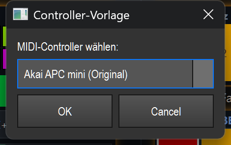

# Smart-Drop & Baukasten (Elemente schnell anlegen)

> ⚠️ **Veraltet (entfernt 2026-07):** Die hier beschriebenen Editor-Bausteine (Controller-Vorlage, Color-Chase, Chase-Bereich) wurden aus der virtuellen Konsole entfernt. Stattdessen gibt es jetzt das **Live-Edit-Panel** (ein Widget auf der VC-Fläche, siehe `docs/LIVE_EDIT_FENSTER.md`).

> Statt Bedien-Elemente einzeln von Hand aufzubauen und zu verdrahten, zieht LightOS einen Effekt aus dem Funktions-Baum auf die Konsole und schlägt dir die passenden, schon fertig verkabelten Regler vor — oder setzt auf Knopfdruck ganze Blöcke (MIDI-Controller, Color-Chase).

## Zwei Wege, ein Element anzulegen (Toolbar-Knopf vs. Effekt auf die Canvas ziehen)

Es gibt zwei Arten, ein Bedien-Element auf die virtuelle Konsole zu bekommen:

1. **Toolbar-Knopf (leeres Element):** In der Bearbeiten-Leiste oben tippst du auf einen Widget-Knopf (z. B. „Button", „Fader"). Du bekommst ein **leeres** Element, das du anschließend per Rechtsklick selbst mit einer Funktion verbindest. Gut, wenn du genau weißt, was du willst.

2. **Effekt auf die Canvas ziehen (Smart-Drop):** Du ziehst eine Funktion (Matrix, EFX, Chaser …) aus dem Funktions-Baum auf die freie Konsolen-Fläche. LightOS schaut sich an, **was dieser Effekt überhaupt kann**, und öffnet die Karte **„Effekt einrichten"**. Hier kreuzt du nur an, was du steuern willst — die Regler entstehen schon fertig verdrahtet. Das ist der schnellste Weg und der eigentliche „Baukasten".

> Voraussetzung für beide Wege: der **Bearbeiten-Modus** muss aktiv sein. Im Spielbetrieb sind die Bau-Knöpfe ausgeblendet.

## Effekt einrichten (Smart-Drop-Karte)

Wenn du einen Effekt auf eine freie Stelle ziehst, erscheint diese Karte. Oben steht der Effektname (im Bild „Matrix 1"). Darunter ist **eine Zeile je Aspekt**, den dieser Effekt steuerbar macht — als **Ankreuz-Kästchen** links und dem dazu passenden **Widget** rechts. Du kannst mehrere Häkchen setzen: jedes angekreuzte Kästchen wird zu einem eigenen, fertig verdrahteten Bedien-Element, und alles entsteht in **einem** Arbeitsschritt (ein gemeinsames Rückgängig).

> **Wichtig:** Smart-Drop erzeugt dabei **keinen zweiten Effekt**. Alle Regler werden direkt an die vorhandene Funktion gebunden. Bei Matrix-Effekten zeigt die Karte zusätzlich den Kanalbereich: **nur Farbe**, **nur Dimmer**, **nur Shutter** oder bewusst **Farbe + Dimmer**. Unpassende Regler und Aktionen werden ausgeblendet.

**An/Aus (Toggle)** ist von Anfang an vorangekreuzt — das ist der Standardfall. Wenn du sonst nichts änderst und auf **„Erstellen"** klickst, bekommst du genau einen An/Aus-Button. Welche Zeilen erscheinen, hängt vom Effekt ab; mögliche Aspekte sind:

- **An/Aus (Toggle)** — Button, der den Effekt startet/stoppt (vorangekreuzt).
- **Flash (nur gehalten)** — Button, der den Effekt nur läuft, solange du ihn gedrückt hältst.
- **Tempo (Geschwindigkeit)** — direkte Effekt-Geschwindigkeit. Standard-Widget ist das **Speed-Rad**, alternativ ein Fader.
- **Farb-Pegel / Dimmer-Pegel / Helligkeit** — passend zum tatsächlichen Kanalbereich des Effekts; ein reiner Farbeffekt bekommt dadurch keinen Dimmerkanal.
- **Farben ändern…** — öffnet den **Farb-Editor** (Farbpalette des Effekts bearbeiten).
- **Bewegung (XY-Feld)…** — nur bei EFX: ein XY-Feld, das Zentrum/Größe der Bewegung steuert.
- **Tempo-Bus zuweisen…** — **Bus-Auswahl**: hängt den Effekt an einen gemeinsamen Tempo-Bus (A/B/C …).
- **Tempo-Multiplikator (×½ ×2)…** — ein **Speed-Rad** im Multiplikator-Modus: das Effekt-Tempo läuft relativ zum Tempo-Bus (z. B. halb oder doppelt so schnell).

Selten gebrauchte Einzel-Parameter und Aktionen stehen nicht direkt in der Liste, sondern aufgeklappt unter **„Mehr Parameter (…)"** ganz unten — die Zahl in Klammern sagt, wie viele es sind.
Diskrete Werte wie Richtung, Modus oder An/Aus-Optionen erhalten eine **+/−-Schrittwahl** statt eines ungenauen Faders. Abhängige Parameter erscheinen erst, wenn sie im Effekt aktiv sind (z. B. das Farbwechsel-Intervall erst nach Aktivierung von „Farbe pro Runde wechseln").

Ganz unten gibt es zusätzlich das Kästchen **„Als Effekt-Box gruppieren"**: damit landen alle gewählten Elemente in **einem** beweglichen Container mit Live-Vorschau, statt einzeln verstreut auf die Canvas.

> Bei einem Aspekt mit nur einem sinnvollen Widget ist der rechte Knopf nur eine Beschriftung (ausgegraut). Bei mehreren Möglichkeiten steht dort **„Widget: … ▸ ändern"** — ein Klick öffnet die Galerie.

## Widget wählen (grafische Galerie)

Wenn für einen Aspekt mehrere Widget-Typen passen (z. B. **Speed-Rad** oder **Fader** für Tempo), öffnet der „▸ ändern"-Knopf diese kleine Galerie. Jeder Kandidat wird als **Kachel mit gemalter Vorschau** gezeigt, damit du auf einen Blick siehst, wie das Bedien-Element aussieht. Tippe eine Kachel an (die aktuelle ist blau markiert) und bestätige mit **OK** — oder Doppelklick auf die Kachel. Die Galerie schlägt nur die für diesen Aspekt sinnvollen Typen vor; eine falsche Wahl ist also gar nicht erst möglich.

> Dieselbe Galerie erreichst du später jederzeit über das Rechtsklick-Menü eines vorhandenen Elements („↔ Widget ändern"), um z. B. einen Fader nachträglich in ein Speed-Rad zu verwandeln.

## Drop auf einen belegten Regler (Konflikt-Karte)

Ziehst du einen Effekt direkt auf einen Regler, der **schon** etwas steuert (z. B. ein Speed-Rad, das bereits „Matrix 1" regelt), fragt LightOS nach, statt stillschweigend etwas dazuzuhängen. Die Karte nennt oben, was der Regler bisher steuert, und bietet drei klare Wege:

- **Ersetzen** — der Regler steuert danach **nur noch** den neuen Effekt; die alte Bindung fällt weg.
- **Dazu koppeln** — beide Effekte hängen am **selben** Regler und bilden eine Gruppe mit **einem gemeinsamen Tempo**. Praktisch, um mehrere Effekte synchron laufen zu lassen.
- **Neues Widget daneben** — lässt den vorhandenen Regler in Ruhe und legt für den neuen Effekt ein **eigenes** Bedien-Element direkt daneben an.

**Abbrechen** lässt alles, wie es war.

## Komplette Blöcke: Controller, Color-Chase, Chase-Bereich

Neben einzelnen Elementen kannst du in der Bearbeiten-Leiste mit drei grünen Knöpfen ganze, fertige Blöcke einsetzen:

- **⌗ Controller** — legt das **Abbild eines MIDI-Pad-Controllers** auf die Seite: ein beschriftetes 8×8-Pad-Raster plus Fader-Reihe, jede Taste schon auf die richtige MIDI-Note bzw. jeder Fader auf den richtigen CC gemappt. Du wählst nur das Modell (im Bild „Akai APC mini (Original)", außerdem „APC mini mk2"). So siehst du auf der Konsole genau, **wo welche Hardware-Taste liegt**, und musst den Pads nur noch per Rechtsklick Funktionen/Farben zuweisen.

- **🎨 Color-Chase** — legt einen kompletten **Live-Color-Chase-Baukasten** an: Farb-Pads (im Modus „Farbe hinzufügen"), die Tasten **Start**, **Clear**, **Farbe −/+** sowie zwei Fader für **Speed** und **Übergang**. Dazu erzeugt LightOS automatisch eine passende **COLORFADE-Funktion**, an die alles schon gebunden ist. Ablauf zum Spielen: **Clear → Farben antippen → Start**.

- **🟦 Chase-Bereich** — wie Color-Chase, aber du **ziehst zuerst ein Rechteck** auf der Canvas auf; der Baukasten wird passend in diesen Bereich skaliert hineingelegt. (Dafür muss der Bearbeiten-Modus aktiv sein.)

## Color-Chase auf eine Gruppe

Bei **🎨 Color-Chase** und **🟦 Chase-Bereich** fragt LightOS zuerst, **auf welche Fixtures** der Chase wirken soll. Wählst du **„Alle Fixtures"**, betrifft der Chase alle gepatchten Geräte; ansonsten erscheinen hier deine angelegten **Fixture-Gruppen**, und der Chase wirkt nur auf die gewählte Gruppe. Die automatisch angelegte COLORFADE-Funktion trägt den Gruppennamen im Titel (z. B. „Color-Chase – Front"), damit du sie später wiederfindest.

## Tipps & Fallen

- **Bearbeiten zuerst.** Die Bau-Knöpfe und der Smart-Drop sind nur im **Bearbeiten-Modus** sichtbar. „🟦 Chase-Bereich" weist sogar ausdrücklich darauf hin, wenn Bearbeiten noch aus ist.
- **Mehrere Häkchen = mehrere Elemente in einem Schritt.** Kreuze in der Karte „Effekt einrichten" ruhig mehrere Aspekte an — das spart Wege und lässt sich mit **einem** Rückgängig (Strg+Z) komplett zurücknehmen.
- **„Erstellen" ohne Änderung** liefert genau einen An/Aus-Button — der schnellste Fall mit einem Klick.
- **Dazu koppeln teilt das Tempo.** Wenn du auf der Konflikt-Karte „Dazu koppeln" wählst, laufen beide Effekte mit **einem** gemeinsamen Tempo. Sollen sie unabhängig bleiben, nimm „Neues Widget daneben".
- **Controller-Vorlage ist nur ein Abbild.** Die Pads sind richtig auf MIDI-Notes gemappt, aber noch **ohne Funktion**. Per Rechtsklick (Funktion/Farbe) belegen; den Fader-Modus stellst du im Eigenschaften-Dialog ein.
- **Color-Chase-Pads warten auf MIDI.** Die Pads/Fader des Color-Chase-Baukastens haben noch keine feste MIDI-Taste — weise sie bei Bedarf per **„MIDI Lernen"** den echten APC-Tasten zu.
- **Color-Chase legt eine echte Funktion an.** Jeder Color-Chase erzeugt im Funktions-Baum eine neue COLORFADE-Matrix. Wenn du den Block wieder löschst, bleibt die Funktion bestehen — sie bei Bedarf separat entfernen.
- **Reihenfolge beim Color-Chase merken:** erst **Clear**, dann **Farben antippen**, dann **Start** — sonst mischt sich Altes mit Neuem.
