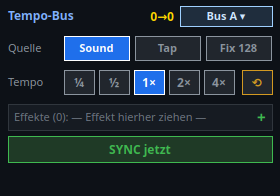

# 22 · Tempo controller (`VCTempoBusController`)

> **English version** of [22 · Tempo-Controller (`VCTempoBusController`)](22_tempo_controller.md). LightOS itself speaks German: every button, menu and field is quoted here **exactly as it appears on screen**, with an English translation in brackets the first time it shows up. The screenshots are the same as in the German page.

> **Toolbar button:** „Tempo-Controller" (edit mode only)
> **Back to the** [widget overview](README.en.md)

A **complete tempo workstation on one tile**: choose the bus, switch the tempo source, set the factor, assign effects and synchronize everything in one go. This makes it the big sister of the plain [tempo bus selector](13_tempo_bus.en.md), which only switches the active bus.

## What you see

| Row | Meaning |
|---|---|
| **Header** | On the left the caption, in the middle the live display `Ist→Soll` (actual→target) (at `0→0` nothing is running yet), on the right the bus selection (`Bus A ▾`). |
| **Quelle** (source) | Where the tempo comes from: **Sound** (beat detection), **Tap** (tapped by hand) or **Fix 128** (a fixed value; the number is the configured fixed BPM). |
| **Tempo** | The factor applied to the bus beat: `¼ · ½ · 1× · 2× · 4×`. The active one is highlighted. The arrow on the right resets to `1×`. |
| **Effekte (N)** (effects (N)) | The assigned effects. Drag them here from the function tree by **drag & drop**, or add them with `+`. `Effekte (0)` means: the controller doesn't act on anything yet. |
| **SYNC jetzt** (SYNC now) | Sets all assigned effects to the start of the bar together. |

## Settings (double-click → „Tempo-Bus-Controller")

| Field | Meaning |
|---|---|
| **Beschriftung** (caption) | Text in the header of the tile. |
| **Tempo-Bus** | Which bus (A/B/C/D) this controller serves. |
| **Quelle** | Preselection for Sound / Tap / fixed BPM. |
| **Feste BPM** (fixed BPM) | The value behind „Fix" — it also appears on the button. |
| **Effekte** | Assignment line by line; for each line you can also choose **what** is controlled on the effect. |
| **Faktor-Set** (factor set) | Which factor buttons appear, comma-separated (e.g. `¼, ½, 1, 2, 4`). |

## What it is for

The tempo bus is the shared beat of several effects. Without this controller, operating it is spread over several places — choose the bus here, the factor there, sync in the menu. On a bank with little space, a tile that combines all four is faster to use during a show than four elements side by side.

**`Effekte (0)` is the most common pitfall:** the controller then looks fully functional, and `SYNC jetzt` even acknowledges — only nobody is listening to it. So before using it for the first time, check that the number in brackets is right.

## Related

- [13 · Tempo bus](13_tempo_bus.en.md) — only the bus selection, smaller
- [05 · Speed dial](05_speed_dial.en.md) — tempo as a rotary dial, per effect
- [12 · BPM display](12_bpm_anzeige.en.md) — display only
- [20 · BPM manager](20_bpm_manager.en.md) — the full management outside the VC
