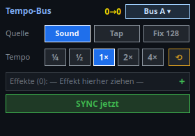

# 22 · Tempo-Controller (`VCTempoBusController`)

> **Toolbar-Knopf:** „Tempo-Controller" (nur im Bearbeiten-Modus)
> **Zurück zur** [Widget-Übersicht](README.md)

Ein **kompletter Tempo-Arbeitsplatz auf einer Kachel**: Bus wählen, Tempoquelle
umschalten, Faktor setzen, Effekte zuordnen und alles auf einen Schlag
synchronisieren. Er ist damit die große Schwester des reinen
[Tempo-Bus-Wählers](13_tempo_bus.md), der nur den aktiven Bus umschaltet.

## Was man sieht

| Zeile | Bedeutung |
|---|---|
| **Kopf** | Links die Beschriftung, in der Mitte die Live-Anzeige `Ist→Soll` (bei `0→0` läuft noch nichts), rechts die Bus-Auswahl (`Bus A ▾`). |
| **Quelle** | Woher das Tempo kommt: **Sound** (Beat-Erkennung), **Tap** (von Hand getippt) oder **Fix 128** (fester Wert; die Zahl ist die eingestellte feste BPM). |
| **Tempo** | Der Faktor auf den Bus-Takt: `¼ · ½ · 1× · 2× · 4×`. Der aktive steht hervorgehoben. Der Pfeil rechts setzt auf `1×` zurück. |
| **Effekte (N)** | Die zugeordneten Effekte. Per **Drag&Drop** aus dem Funktions-Baum hierher ziehen, oder über `+`. `Effekte (0)` heißt: der Controller wirkt noch auf nichts. |
| **SYNC jetzt** | Setzt alle zugeordneten Effekte gemeinsam auf den Takt-Anfang. |

## Einstellungen (Doppelklick → „Tempo-Bus-Controller")

| Feld | Bedeutung |
|---|---|
| **Beschriftung** | Text im Kopf der Kachel. |
| **Tempo-Bus** | Welchen Bus (A/B/C/D) dieser Controller bedient. |
| **Quelle** | Vorauswahl für Sound / Tap / feste BPM. |
| **Feste BPM** | Der Wert hinter „Fix" — er steht auch auf dem Knopf. |
| **Effekte** | Zeilenweise Zuordnung; je Zeile lässt sich zusätzlich wählen, **was** am Effekt gesteuert wird. |
| **Faktor-Set** | Welche Faktor-Knöpfe erscheinen, komma-getrennt (z. B. `¼, ½, 1, 2, 4`). |

## Wozu

Der Tempo-Bus ist der gemeinsame Takt mehrerer Effekte. Ohne diesen Controller
verteilt sich seine Bedienung auf mehrere Stellen — Bus wählen hier, Faktor dort,
Sync im Menü. Auf einer Bank mit wenig Platz ist eine Kachel, die alles vier
zusammenfasst, im Betrieb schneller als vier Elemente nebeneinander.

**`Effekte (0)` ist die häufigste Stolperstelle:** der Controller sieht dann voll
funktionsfähig aus, `SYNC jetzt` quittiert auch — nur hört ihm niemand zu. Vor dem
ersten Einsatz also prüfen, dass die Zahl in der Klammer stimmt.

## Verwandt

- [13 · Tempo-Bus](13_tempo_bus.md) — nur die Bus-Auswahl, kleiner
- [05 · Speed-Dial](05_speed_dial.md) — Tempo als Drehrad, je Effekt
- [12 · BPM-Anzeige](12_bpm_anzeige.md) — reine Anzeige
- [20 · BPM-Manager](20_bpm_manager.md) — die große Verwaltung außerhalb der VC
