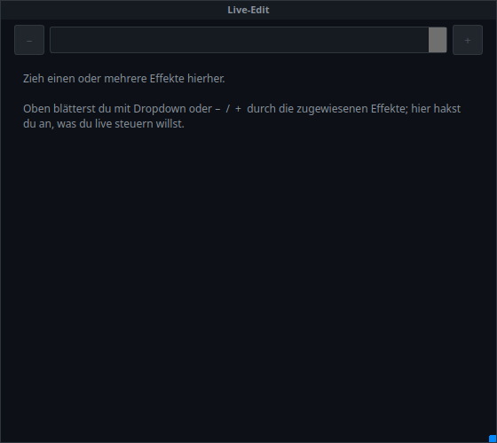

# 23 · Live edit panel (`VCMultiLiveEditor`)

> **English version** of [23 · Live-Edit-Panel (`VCMultiLiveEditor`)](23_live_edit.md). LightOS itself speaks German: every button, menu and field is quoted here **exactly as it appears on screen**, with an English translation in brackets the first time it shows up. The screenshots are the same as in the German page.

> **Toolbar button:** „Live-Edit" (edit mode only)
> **Back to the** [widget overview](README.en.md)

A **control workstation for several effects on one surface**. You drag effects into it, page through them at the top, and below that you get exactly the controls you ticked beforehand.

> When freshly created, it is empty and tells you itself what to do — that is exactly how it should look. The content only appears once effects are assigned.

## What you see

| Element | Meaning |
|---|---|
| **Header** | The panel's caption. |
| **`–` / dropdown / `+`** | Pages through the assigned effects. The body always shows the **currently selected** one. |
| **Body** | The controls of the selected effect — each matching its type: floating-point values as a **slider**, integers as **–/+**, yes/no as a **switch**, a choice as a **button group**, a direction as **arrows** (`→` forward, `←` backward, `↔` ping-pong …). In addition, a preview and a tempo mode per effect. |

**Assigning effects:** drag a function (matrix, chaser, EFX …) from the function tree into the panel by drag & drop. Several effects are explicitly intended.

## The core idea: two modes, one panel

The panel depends on the **VC edit mode** — and that is not a side issue but its actual operating concept:

| VC mode | What the panel shows |
|---|---|
| **Bearbeiten ✓** (edit on) | The **checkbox selection**: all live-controllable parameters of the effect as checkboxes. Here you tick *what* you want to operate later — individually per effect. |
| **Bearbeiten aus** (edit off — i.e. operation) | Only the **ticked** controls, tidy and without the checkbox list. Ready to use. |

So if you miss a control during operation, you haven't lost it — it just isn't ticked in edit mode.

## What is saved

The show stores: geometry and caption, **which effects** are assigned (`fids`) and **which controls are ticked** (`checked`). The live values you set belong to the respective effect, not to the panel.

## Related

- [18 · Effect editor box](18_effekt_editor.en.md) — the same for **one** effect
- [16 · Effect display](16_effekt_anzeige.en.md) — preview only, without controls
- [21 · Smart-Drop & building kit](21_baukasten.en.md) — set up an effect as you drag it in
- `docs/LIVE_EDIT_FENSTER.md` (German) — the standalone live edit window outside the VC
