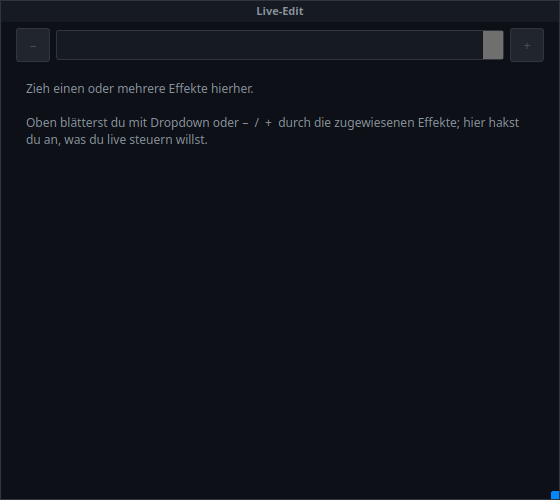

# 23 · Live-Edit-Panel (`VCMultiLiveEditor`)

> **Toolbar-Knopf:** „Live-Edit" (nur im Bearbeiten-Modus)
> **Zurück zur** [Widget-Übersicht](README.md)

Ein **Regler-Arbeitsplatz für mehrere Effekte auf einer Fläche**. Man zieht
Effekte hinein, blättert oben durch sie hindurch und bekommt darunter genau die
Regler, die man vorher angehakt hat.

> Frisch angelegt ist es leer und sagt selbst, was zu tun ist — genau so soll es
> aussehen. Der Inhalt entsteht erst durch die zugewiesenen Effekte.

## Was man sieht

| Element | Bedeutung |
|---|---|
| **Kopf** | Die Beschriftung des Panels. |
| **`–` / Dropdown / `+`** | Blättert durch die zugewiesenen Effekte. Der Body zeigt immer den **gerade gewählten**. |
| **Body** | Die Regler des gewählten Effekts — je Typ passend: Fließkomma als **Schieber**, Ganzzahl als **–/+**, Ja/Nein als **Schalter**, Auswahl als **Knopfgruppe**, Richtung als **Pfeile** (`→` vorwärts, `←` rückwärts, `↔` Ping-Pong …). Dazu je Effekt eine Vorschau und ein Tempo-Modus. |

**Effekte zuweisen:** eine Funktion (Matrix, Chaser, EFX …) aus dem Funktions-Baum
per Drag&Drop in das Panel ziehen. Mehrere sind ausdrücklich vorgesehen.

## Der Kern: zwei Modi, ein Panel

Das Panel hängt am **VC-Bearbeiten-Modus** — und das ist keine Nebensache, sondern
seine eigentliche Bedienidee:

| VC-Modus | Was das Panel zeigt |
|---|---|
| **Bearbeiten ✓** | Die **Haken-Auswahl**: alle live-steuerbaren Parameter des Effekts als Kästchen. Hier hakt man an, *was* man später bedienen will — pro Effekt einzeln. |
| **Bearbeiten aus** (Betrieb) | Nur die **angehakten** Regler, aufgeräumt und ohne Kästchen-Liste. Bereit zum Bedienen. |

Wer im Betrieb einen Regler vermisst, hat ihn also nicht verloren — er ist im
Bearbeiten-Modus nicht angehakt.

## Was gespeichert wird

Mit der Show wandern mit: Geometrie und Beschriftung, **welche Effekte** zugewiesen
sind (`fids`) und **welche Regler angehakt** sind (`checked`). Die eingestellten
Live-Werte selbst gehören dem jeweiligen Effekt, nicht dem Panel.

## Verwandt

- [18 · Effekt-Editor-Box](18_effekt_editor.md) — dasselbe für **einen** Effekt
- [16 · Effekt-Anzeige](16_effekt_anzeige.md) — nur Vorschau, ohne Regler
- [21 · Smart-Drop & Baukasten](21_baukasten.md) — Effekt einrichten beim Hineinziehen
- `docs/LIVE_EDIT_FENSTER.md` — das eigenständige Live-Edit-Fenster außerhalb der VC
