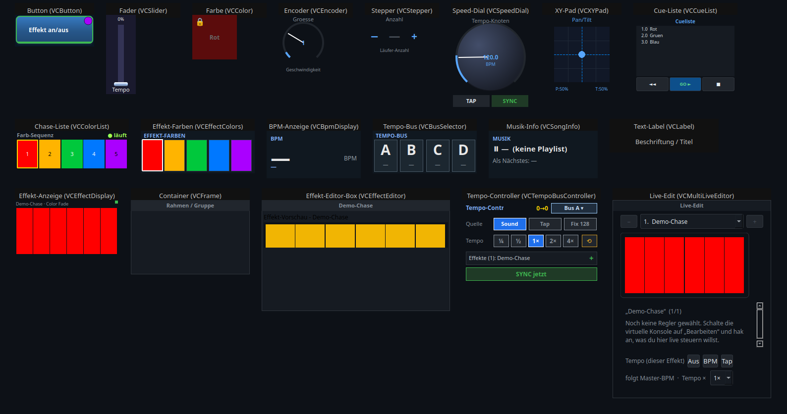
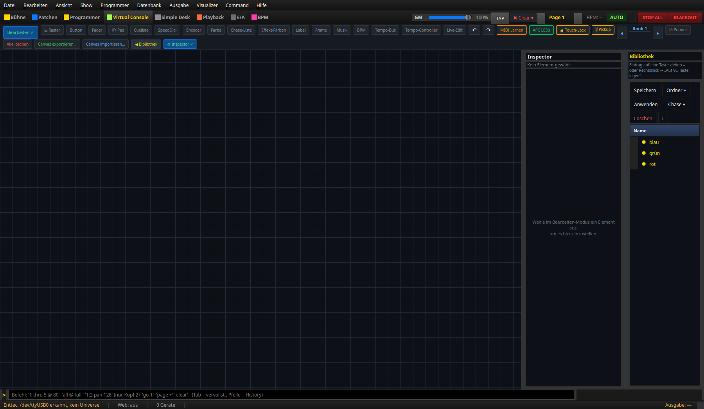

# Virtual Console — widget list & reference

> **English version** of [Virtuelle Konsole — Widget-Liste & Referenz](README.md). LightOS
> itself speaks German: every button, menu and field is quoted here **exactly as it
> appears on screen**, with an English translation in brackets the first time it shows
> up. The screenshots are the same as in the German pages.

The **Virtual Console (VC)** of LightOS is a control surface you design yourself: you put
buttons, faders, color tiles, displays and so on onto an area and control your show with
them — by mouse/touch, MIDI controller (e.g. APC mini) or keyboard.

This reference describes **every control element on its own**: what it is for, what it
looks like while running, **which button does what** and which settings it has — each with
real screenshots from the app.

> This overview shows **all 19** widget types, each labelled. It comes from the template
> show `shows/VC_Widgets_Showcase.lshow` (generator:
> `tools/build_vc_widgets_showcase.py`). **Tempo-Controller** and **Live-Edit-Panel** are at
> the bottom right; they are described in [22](22_tempo_controller.en.md) and
> [23](23_live_edit.en.md).

---

## Basics (apply to all elements)

**Edit vs. operation.** At the top left the button **„Bearbeiten"** (edit) switches between
two modes:

- **Bearbeiten ✓** — **create, move, resize and configure** elements. Extra toolbar buttons
  appear: **one button per widget type** (16 of them), **⊞ Raster** (grid), **Undo/Redo**
  (`↶ ↷`), **Alle löschen** (delete all) and **⚙ Inspector**.

  

  > There used to be a "Baukasten" (construction kit) here as well. The green construction
  > kit blocks were **removed in 2026-07** (see
  > [21 · Smart-Drop & Baukasten](21_baukasten.en.md)); the quick way is now Smart-Drop.
- **Betrieb** (operation; edit off) — elements **control the show live**. Click/touch/MIDI
  trigger their function.

**Creating an element — two ways:**

1. **Toolbar button** (edit mode only): puts the element in the middle of the canvas.
2. **Drag an effect from the library onto the canvas** (*Smart-Drop*): LightOS builds the
   matching control element practically by itself → see
   **[Smart-Drop & Baukasten](21_baukasten.en.md)**.

> Three of the 19 types have **no** toolbar button of their own and are only created via
> Smart-Drop / the widget gallery: **Stepper**, **Effekt-Anzeige** (effect display) and
> **Effekt-Editor-Box** (effect editor box). The other 16 each have a button.

**Settings & context menu.** A **double-click** on an element opens its **Einstellungen**
(settings) (exception: color tile — double-click = color picker). A **right-click** (in
edit mode) opens the context menu:

- **Einstellungen…** (settings), **🎹 MIDI Teach…**, **⌨ Taste zuweisen…** (assign key)
- **Bank** (Alle Banks = all banks / Bank 1…10), **Löschen** (delete),
  **Vordergrund-/Hintergrund-Farbe** (foreground/background color)
- for effect-bound elements additionally **⚡ Live-Parameter…** (live parameters) and
  **↔ Widget ändern…** (change widget)

**Banks.** Each VC bank corresponds to a **playback/executor page** (VC bank N = page N). An
element on „**Alle Banks**" is always visible; otherwise only on its own bank. The APC page
buttons switch the same bank.

**Effect binding.** Many elements control an **effect** (RGB matrix, EFX, chaser …). The
element only remembers the **effect ID (`function_id`)**; the live effect runs through a
shared interface (`effect_live`). MIDI uses the same binding.

**Touch-Lock.** Locks mouse/touch during operation (display only, protects against
accidental taps) — **MIDI/APC keeps working**.

---

## The 19 control elements

| # | Element | In short | Page |
|---|---|---|---|
| 01 | **Button** (`VCButton`) | control button: function on/off, flash, action, snapshot … | [01_button.en.md](01_button.en.md) |
| 02 | **Fader** (`VCSlider`) | slider: level, master, tempo, effect parameters … | [02_fader.en.md](02_fader.en.md) |
| 03 | **Farbe** (color, `VCColor`) | color tile: sets a color on fixtures/an effect | [03_farbe.en.md](03_farbe.en.md) |
| 04 | **XY-Pad** (`VCXYPad`) | 2D field for pan/tilt or a movement field/path | [04_xy_pad.en.md](04_xy_pad.en.md) |
| 05 | **Speed-Dial** (`VCSpeedDial`) | tempo wheel: BPM, tap, factor, tempo bus | [05_speed_dial.en.md](05_speed_dial.en.md) |
| 06 | **Encoder** (`VCEncoder`) | relative rotary encoder for one effect parameter | [06_encoder.en.md](06_encoder.en.md) |
| 07 | **Stepper** (`VCStepper`) | +/− step counter for whole-number parameters | [07_stepper.en.md](07_stepper.en.md) |
| 08 | **Cue-Liste** (cue list, `VCCueList`) | GO / BACK / STOP transport for a cue list | [08_cue_liste.en.md](08_cue_liste.en.md) |
| 09 | **Chase-Liste** (chase list, `VCColorList`) | switch an effect's color sequence on/off | [09_chase_liste.en.md](09_chase_liste.en.md) |
| 11 | **Effekt-Farben** (effect colors, `VCEffectColors`) | edit an effect's color sequence | [11_effekt_farben.en.md](11_effekt_farben.en.md) |
| 12 | **BPM-Anzeige** (BPM display, `VCBpmDisplay`) | live display of tempo + source | [12_bpm_anzeige.en.md](12_bpm_anzeige.en.md) |
| 13 | **Tempo-Bus** (`VCBusSelector`) | choose the active tempo bus (A/B/C/D) | [13_tempo_bus.en.md](13_tempo_bus.en.md) |
| 14 | **Musik-Info** (music info, `VCSongInfo`) | shows the current/next song | [14_musik_info.en.md](14_musik_info.en.md) |
| 15 | **Text-Label** (`VCLabel`) | caption / title | [15_text_label.en.md](15_text_label.en.md) |
| 16 | **Effekt-Anzeige** (effect display, `VCEffectDisplay`) | live preview of the bound effect | [16_effekt_anzeige.en.md](16_effekt_anzeige.en.md) |
| 17 | **Container** (`VCFrame`) | frame/group that holds elements (pages/tabs) | [17_container.en.md](17_container.en.md) |
| 18 | **Effekt-Editor-Box** (effect editor box, `VCEffectEditor`) | movable box: preview + the matching faders of an effect | [18_effekt_editor.en.md](18_effekt_editor.en.md) |
| 22 | **Tempo-Controller** (`VCTempoBusController`) | bus, source, factor, effect assignment and sync on one tile | [22_tempo_controller.en.md](22_tempo_controller.en.md) |
| 23 | **Live-Edit-Panel** (`VCMultiLiveEditor`) | fader workspace for SEVERAL effects, with tick-box selection | [23_live_edit.en.md](23_live_edit.en.md) |

## Large editors (reachable from the VC)

| Editor | In short | Page |
|---|---|---|
| **RGB-Matrix-Editor** | algorithms, style, colors, fixture grid, live preview | [19_matrix_editor.en.md](19_matrix_editor.en.md) |
| **BPM-Manager** | tempo detection & management, tempo buses, grand master | [20_bpm_manager.en.md](20_bpm_manager.en.md) |

## Convenience

| Topic | In short | Page |
|---|---|---|
| **Smart-Drop & Baukasten** | set up an effect, widget gallery, conflict map, controller/color-chase blocks | [21_baukasten.en.md](21_baukasten.en.md) |

---

*Screenshots from the running LightOS app. Template show:
`shows/VC_Widgets_Showcase.lshow` · generator: `tools/build_vc_widgets_showcase.py`.*
