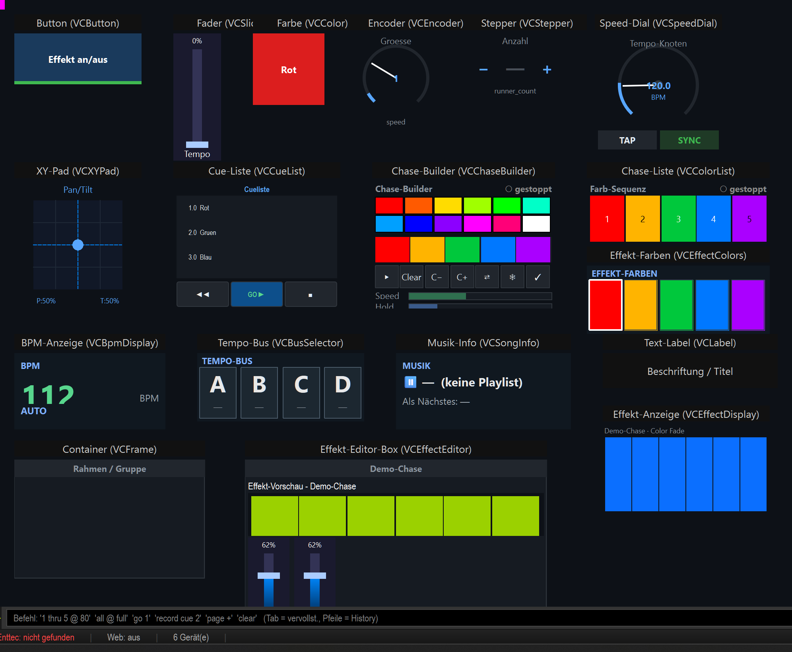

# Virtuelle Konsole — Widget-Liste & Referenz

Die **Virtuelle Konsole (VC)** von LightOS ist eine frei gestaltbare Bedienoberfläche:
Du legst Tasten, Fader, Farb-Kacheln, Anzeigen usw. auf eine Fläche und steuerst damit
deine Show — per Maus/Touch, MIDI-Controller (z. B. APC mini) oder Tastatur.

Diese Referenz beschreibt **jedes Bedien-Element einzeln**: wozu es da ist, wie es im
Betrieb aussieht, **welcher Knopf was macht** und welche Einstellungen es hat — jeweils mit
echten Screenshots aus der App.

> Diese Übersicht stammt aus der Vorlage-Show `shows/VC_Widgets_Showcase.lshow`
> (Generator: `tools/build_vc_widgets_showcase.py`) — sie legt jeden der 18 Widget-Typen
> einmal beschriftet ab.

---

## Grundlagen (gilt für alle Elemente)

**Bearbeiten vs. Betrieb.** Oben links schaltet der Knopf **„Bearbeiten"** zwischen zwei
Modi um:

- **Bearbeiten ✓** — Elemente **anlegen, verschieben, skalieren, einstellen**. Es
  erscheinen zusätzliche Toolbar-Knöpfe (alle Widget-Typen, Baukasten, Undo/Redo, Raster).
- **Betrieb** (Bearbeiten aus) — Elemente **steuern live** die Show. Klick/Touch/MIDI lösen
  ihre Funktion aus.

**Ein Element anlegen — zwei Wege:**

1. **Toolbar-Knopf** (nur im Bearbeiten-Modus): legt das Element in der Canvas-Mitte ab.
2. **Effekt aus der Bibliothek auf die Canvas ziehen** (*Smart-Drop*): LightOS baut das
   passende Bedien-Element praktisch von selbst → siehe **[Smart-Drop & Baukasten](21_baukasten.md)**.

> Drei Typen haben **keinen** eigenen Toolbar-Knopf und entstehen nur über Smart-Drop /
> die Widget-Galerie: **Stepper**, **Effekt-Anzeige** und **Effekt-Editor-Box**.

**Einstellen & Kontextmenü.** **Doppelklick** auf ein Element öffnet seine **Einstellungen**
(Ausnahme Farb-Kachel: Doppelklick = Farb-Picker). **Rechtsklick** (im Bearbeiten-Modus)
öffnet das Kontextmenü:

- **Einstellungen…**, **🎹 MIDI Teach…**, **⌨ Taste zuweisen…**
- **Bank** (Alle Banks / Bank 1…10), **Löschen**, **Vordergrund-/Hintergrund-Farbe**
- bei effektgebundenen Elementen zusätzlich **⚡ Live-Parameter…** und **↔ Widget ändern…**

**Bänke.** Jede VC-Bank entspricht einer **Playback-/Executor-Seite** (VC-Bank N = Seite N).
Ein Element auf „**Alle Banks**" ist immer sichtbar; sonst nur auf seiner Bank. Die
APC-Page-Tasten schalten dieselbe Bank.

**Effekt-Bindung.** Viele Elemente steuern einen **Effekt** (RGB-Matrix, EFX, Chaser …).
Das Element merkt sich nur die **Effekt-ID (`function_id`)**; die Live-Wirkung läuft über
eine gemeinsame Schnittstelle (`effect_live`). Dieselbe Bindung nutzt auch MIDI.

**Touch-Lock.** Sperrt im Betrieb Maus/Touch (reine Anzeige, schützt vor versehentlichem
Antippen) — **MIDI/APC steuert weiter**.

---

## Die 18 Bedien-Elemente

| # | Element | Kurz | Seite |
|---|---|---|---|
| 01 | **Button** (`VCButton`) | Steuertaste: Funktion an/aus, Flash, Aktion, Snapshot … | [01_button.md](01_button.md) |
| 02 | **Fader** (`VCSlider`) | Schieberegler: Level, Master, Tempo, Effekt-Parameter … | [02_fader.md](02_fader.md) |
| 03 | **Farbe** (`VCColor`) | Farb-Kachel: setzt eine Farbe auf Geräte/Effekt | [03_farbe.md](03_farbe.md) |
| 04 | **XY-Pad** (`VCXYPad`) | 2D-Feld für Pan/Tilt bzw. Bewegungs-Feld/Pfad | [04_xy_pad.md](04_xy_pad.md) |
| 05 | **Speed-Dial** (`VCSpeedDial`) | Tempo-Rad: BPM, Tap, Faktor, Tempo-Bus | [05_speed_dial.md](05_speed_dial.md) |
| 06 | **Encoder** (`VCEncoder`) | Relativ-Drehgeber für einen Effekt-Parameter | [06_encoder.md](06_encoder.md) |
| 07 | **Stepper** (`VCStepper`) | +/− Schrittzähler für ganzzahlige Parameter | [07_stepper.md](07_stepper.md) |
| 08 | **Cue-Liste** (`VCCueList`) | GO / BACK / STOP-Transport für eine Cueliste | [08_cue_liste.md](08_cue_liste.md) |
| 09 | **Chase-Liste** (`VCColorList`) | Farb-Sequenz eines Effekts an/aus schalten | [09_chase_liste.md](09_chase_liste.md) |
| 11 | **Effekt-Farben** (`VCEffectColors`) | Farb-Sequenz eines Effekts editieren | [11_effekt_farben.md](11_effekt_farben.md) |
| 12 | **BPM-Anzeige** (`VCBpmDisplay`) | Live-Anzeige von Tempo + Quelle | [12_bpm_anzeige.md](12_bpm_anzeige.md) |
| 13 | **Tempo-Bus** (`VCBusSelector`) | Aktiven Tempo-Bus (A/B/C/D) wählen | [13_tempo_bus.md](13_tempo_bus.md) |
| 14 | **Musik-Info** (`VCSongInfo`) | Anzeige aktuelles/nächstes Lied | [14_musik_info.md](14_musik_info.md) |
| 15 | **Text-Label** (`VCLabel`) | Beschriftung / Titel | [15_text_label.md](15_text_label.md) |
| 16 | **Effekt-Anzeige** (`VCEffectDisplay`) | Live-Vorschau des gebundenen Effekts | [16_effekt_anzeige.md](16_effekt_anzeige.md) |
| 17 | **Container** (`VCFrame`) | Rahmen/Gruppe, nimmt Elemente auf (Seiten/Tabs) | [17_container.md](17_container.md) |
| 18 | **Effekt-Editor-Box** (`VCEffectEditor`) | Bewegliche Box: Vorschau + passende Regler eines Effekts | [18_effekt_editor.md](18_effekt_editor.md) |

## Große Editoren (aus der VC erreichbar)

| Editor | Kurz | Seite |
|---|---|---|
| **RGB-Matrix-Editor** | Algorithmen, Style, Farben, Geräte-Grid, Live-Vorschau | [19_matrix_editor.md](19_matrix_editor.md) |
| **BPM-Manager** | Tempo-Erkennung & -Verwaltung, Tempo-Buses, Grand-Master | [20_bpm_manager.md](20_bpm_manager.md) |

## Komfort

| Thema | Kurz | Seite |
|---|---|---|
| **Smart-Drop & Baukasten** | Effekt einrichten, Widget-Galerie, Konflikt-Karte, Controller-/Color-Chase-Blöcke | [21_baukasten.md](21_baukasten.md) |

---

*Screenshots aus der laufenden LightOS-App. Vorlage-Show:
`shows/VC_Widgets_Showcase.lshow` · Generator: `tools/build_vc_widgets_showcase.py`.*
