# Anleitung: Virtual Console live bearbeiten (Workflow verifiziert)

> **Lernziel:** Wie man die Virtual Console (VC) **live** anpasst — bestehende Elemente
> löschen, neue Elemente hinzufügen, einen **Effekt an einen Aus-/Anschalter** binden,
> **Geschwindigkeit** und **Submaster** steuern, **mehrere Effekte auf dieselbe BPM**
> legen und alles **speichern**.
>
> Diese Anleitung wurde am **2026-06-17** Schritt für Schritt in der laufenden App
> durchgeklickt und gefilmt (Show `shows/Event_Demo_2026.lshow`, Bank 3 „Matrix-Effekte").
> Alle Bilder zeigen echte Klicks, keine Montage.

---

## 0. Voraussetzung — Bearbeiten-Modus an

Oben links in der VC-Leiste **„Bearbeiten"** anklicken → wird zu **„Bearbeiten ✓"**.
Erst dann erscheinen die Hinzufügen-Knöpfe (Button, Fader, XY Pad, …) und Widgets
lassen sich auswählen / verschieben / per Rechtsklick bearbeiten.

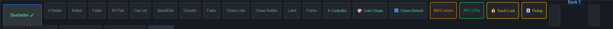

> ⚠ **Wichtigster Stolperstein:** Wenn **„MIDI Lernen"** aktiv ist (Knopf orange
> ausgefüllt), schaltet der **nächste Klick auf einen VC-Button** diesen für die
> **nächste MIDI-Note scharf** — Löschen/Bearbeiten geht dann **nicht**. „MIDI Lernen"
> kann nur **Buttons** scharfschalten; ein **Klick auf einen Fader/XY-Pad bricht den
> Modus ab** (genau wie ein **Klick ins Leere**) — gebunden wird dabei nichts. Es öffnet
> **keinen** Dialog. Vor dem Editieren also sicherstellen, dass
> „MIDI Lernen" **aus** ist (nur Umriss, nicht gefüllt).
>
> Nicht verwechseln: Der Eintrag **„🎹 MIDI Teach..."** (mit Tastatur-Emoji) ist eine
> **separate Kontextmenü-Funktion** (Rechtsklick auf ein Widget) und öffnet erst dann
> den eigentlichen Teach-Dialog mit APC-mini-Abbild.

---

## 1. Bestehende Elemente löschen

Ausgangslage (Bank 3 mit sechs Matrix-Effekt-Tasten):

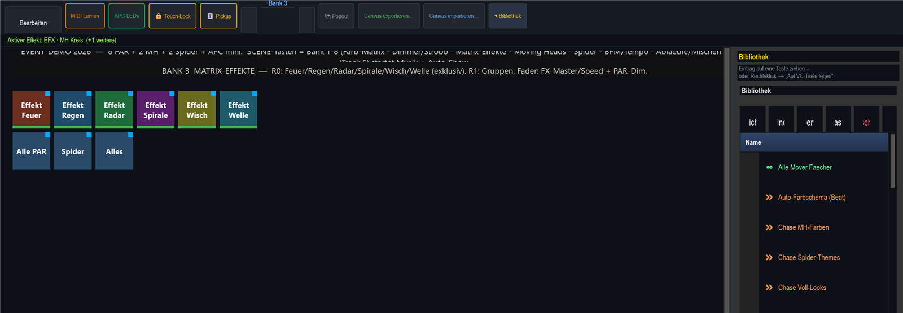

**Rechtsklick** auf die zu löschende Taste → Kontextmenü → **„Löschen"**.

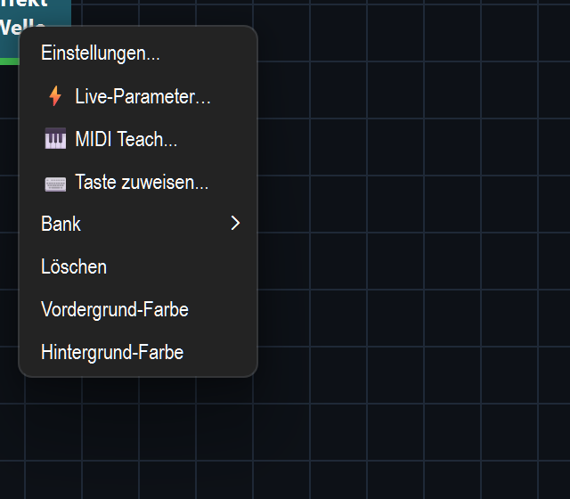

So wurden „Effekt Wisch" und „Effekt Welle" entfernt — es bleiben vier Tasten:

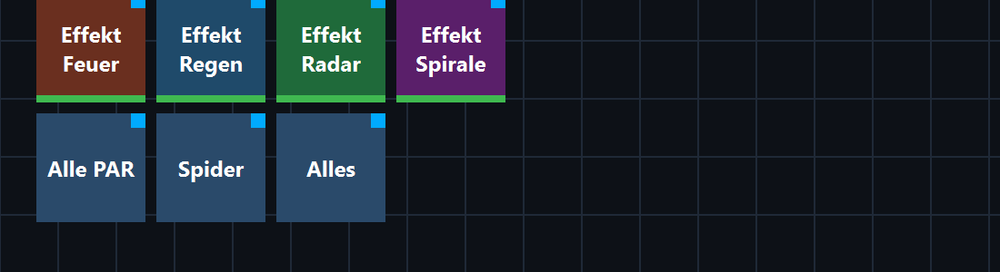

> Das löscht nur die **VC-Taste**, nicht die Effekt-Funktion selbst — die Funktion
> bleibt in der Bibliothek erhalten und kann jederzeit wieder auf eine Taste gelegt werden.

---

## 2. Schneller Weg: Effekt aus der Bibliothek ziehen (Smart-Build)

Der **einfachste** Weg, einen Effekt auf die VC zu bringen: den Effekt aus der
**Bibliothek** direkt auf die Canvas **ziehen** (Drag & Drop). Statt eines fest
verdrahteten Knopfes führt LightOS dann durch den Aufbau:

- **Drop ins Leere** → es öffnet sich die Karte **„Effekt einrichten"** mit der Frage
  *„… — was soll dieser Effekt können?"*. Pro gewünschtem Aspekt ein **Häkchen** setzen
  (z. B. an/aus, Geschwindigkeit, Helligkeit …); je Häkchen kann über **„Widget: … ▸
  ändern"** das Bedien-Element gewählt werden. Über die Kachel-Galerie **„Widget
  wählen"** (*„Bedien-Element wählen — tippe eine Kachel an"*) lässt sich der Widget-Typ
  grafisch aussuchen. Mit **„Erstellen"** entsteht für **jeden** Haken ein fertig
  vorverdrahtetes Widget — alles in **einem** Schritt (ein Undo).
- **Drop auf einen schon belegten Fader** → die Erklär-Karte **„Regler ist schon belegt"**
  fragt nach: **„Ersetzen"** (Regler steuert nur noch den neuen Effekt), **„Dazu koppeln"**
  (beide Effekte am selben Regler, eine Gruppe/ein Tempo) oder **„Neues Widget daneben"**
  (lässt den Regler in Ruhe, legt ein eigenes Bedien-Element an).

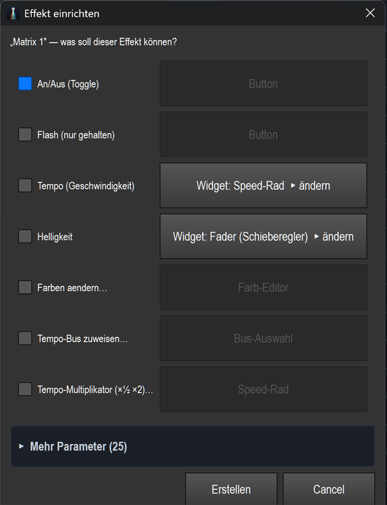

> Der in den folgenden Abschnitten gezeigte Weg über die **Bearbeiten-Toolbar** und das
> **Doppelklick**-Einstellen bleibt weiterhin gültig — als **manueller Alternativweg**,
> wenn man jedes Detail von Hand setzen will oder kein Drag & Drop nutzt.

---

## 3. Effekt an einen An-/Aus-Schalter binden (manuell)

1. In der Bearbeiten-Toolbar auf **„Button"** klicken → eine neue Taste erscheint in der
   Canvas-Mitte. Bei Bedarf an die gewünschte Stelle **ziehen**.
2. Die neue Taste **doppelklicken** → Dialog **„Button Einstellungen"**.

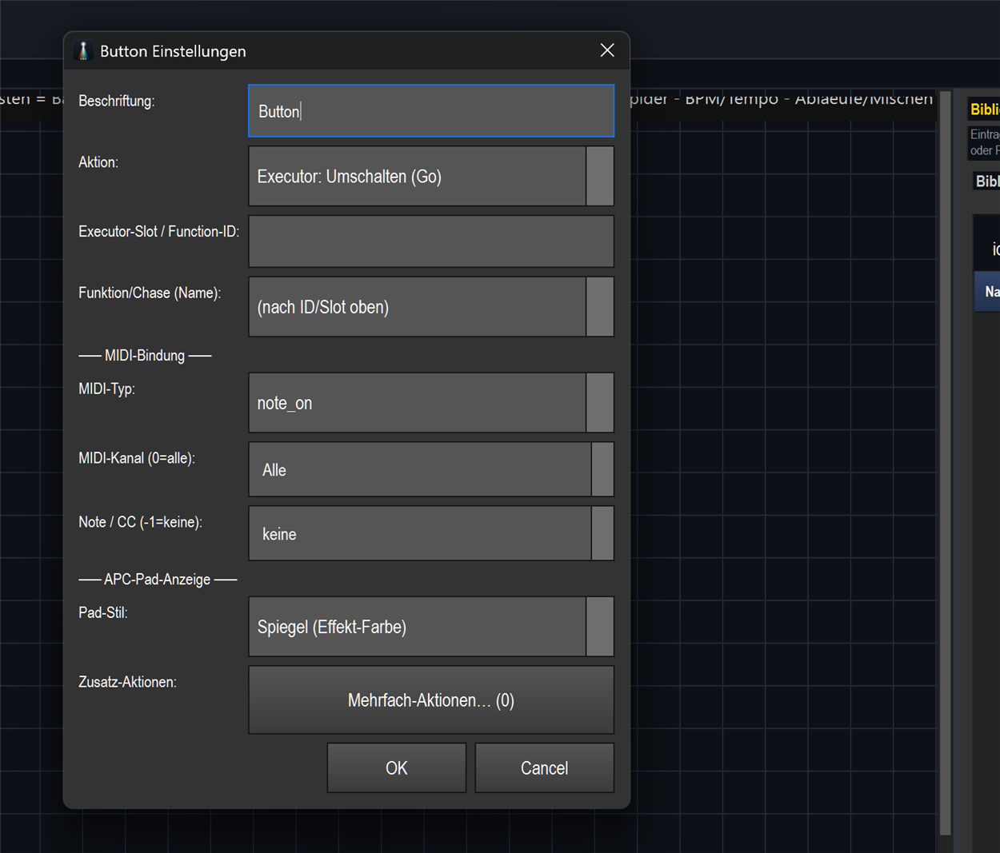

3. Feld **„Aktion:"** aufklappen und **„Funktion an/aus"** wählen (das ist der
   Umschalter — einmal drücken = an, nochmal = aus).

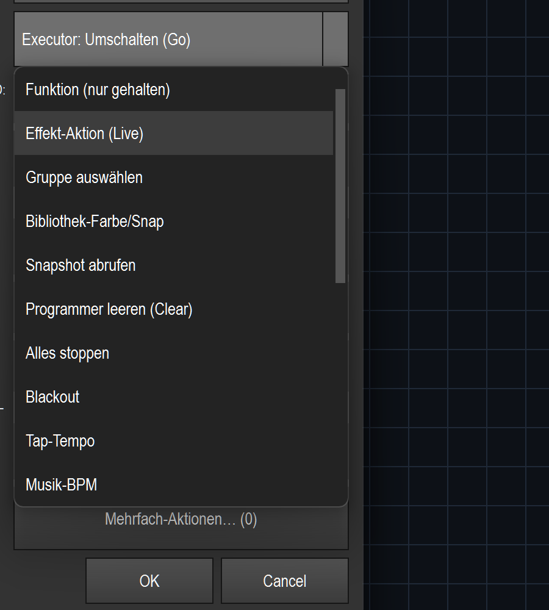

4. Feld **„Funktion/Chase (Name):"** aufklappen und den Effekt wählen (hier
   *Effekt Feuer*). Die Funktions-ID (12) wird automatisch eingetragen.

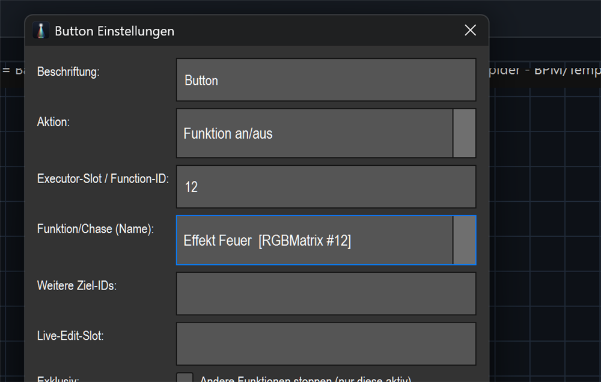

5. Oben bei **„Beschriftung:"** einen Namen vergeben (hier *Feuer An/Aus*), dann **OK**.

Ergebnis — eine Taste mit **grünem Balken** (= an eine Funktion gebunden):

> Im Betrieb (Bearbeiten aus): erster Druck startet *Effekt Feuer*, zweiter Druck
> stoppt ihn. Genau das ist „Effekt-Anbindung an einen Ausschalter".

---

## 4. Geschwindigkeits-Fader (Speed)

1. Toolbar **„Fader"** → neuer Fader erscheint in der Mitte (ggf. zur Seite ziehen).
2. Fader **doppelklicken** → Dialog **„Fader Einstellungen"**.
3. Feld **„Modus:"** aufklappen → Liste aller Modi:

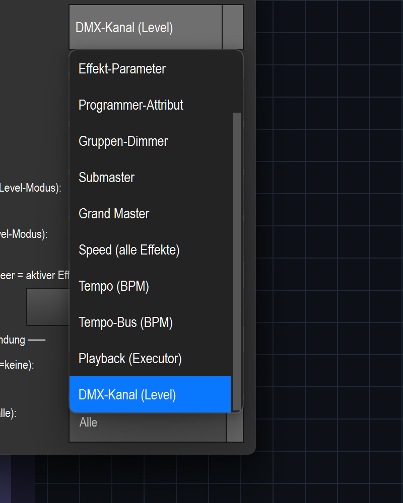

4. **„Speed (alle Effekte)"** wählen, Beschriftung *Speed*, **OK**.

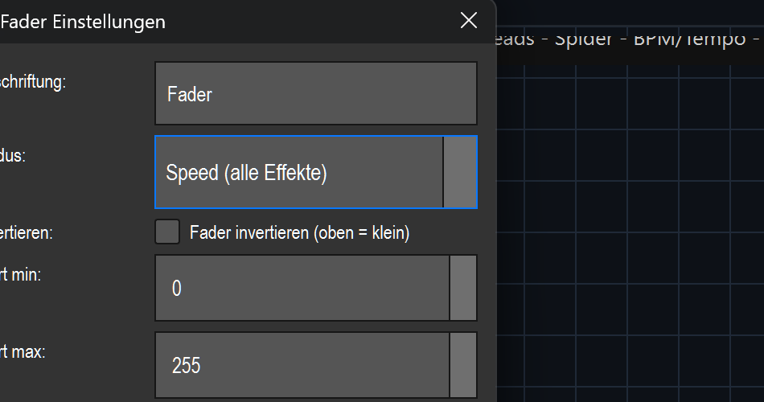

> Dieser Fader skaliert das Tempo **aller** laufenden zeitbasierten Effekte
> (unten = langsam, oben = schnell).

---

## 5. Submaster-Fader

Genauso: **„Fader"** → doppelklicken → **„Modus:" = „Submaster"** → Beschriftung
*Submaster* → **OK**.

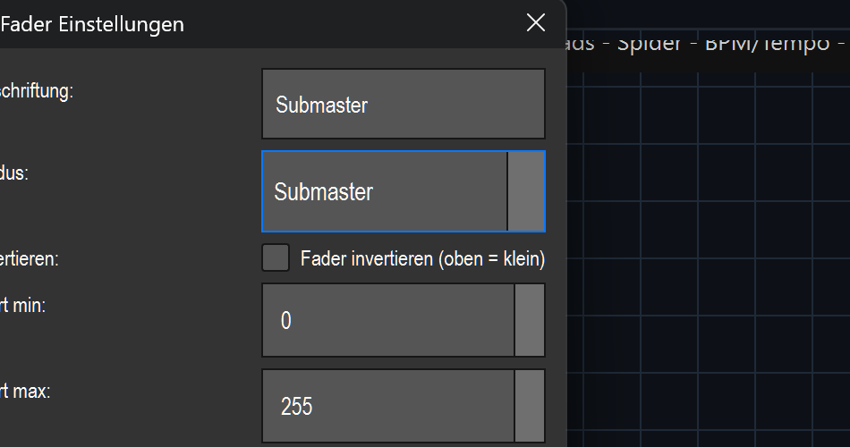

> Ein Submaster fasst Helligkeiten gebündelt unter einen Regler — ideal als Gruppen-
> oder Gesamt-Dimmer neben dem Grand-Master.

---

## 6. Mehrere Effekte auf dieselbe BPM (Tempo-Bus)

1. **„Fader"** → doppelklicken → **„Modus:" = „Tempo-Bus (BPM)"**.
2. Es erscheint ein neues Feld **„Tempo-Bus:"** → aufklappen → **„Bus A"** wählen.

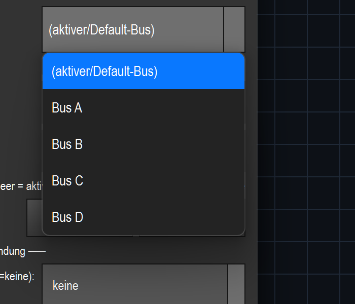

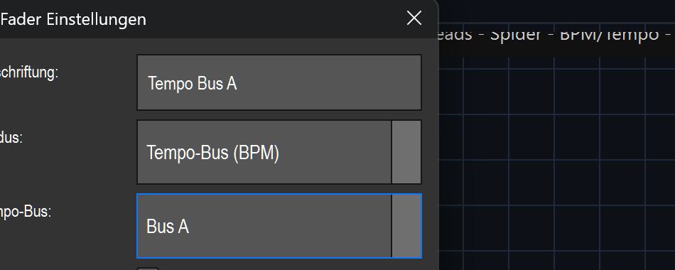

3. Beschriftung *Tempo Bus A*, **OK**.

> **So hängen mehrere Effekte am selben Takt:** In der Event-Demo liegen bereits mehrere
> Bibliotheks-Funktionen fest auf **Bus A** — z. B. *Sync Chase >Bus A* und
> *Sync MH-Kreis >Bus A* (Bank 6 selbst enthält die Tempo-/BPM-**Bedienwidgets**).
> Dieser eine Fader steuert jetzt die BPM von **Bus A** — und damit **alle** daran
> hängenden Effekte gleichzeitig und phasensynchron. Einen **eigenen** Effekt hängt man
> so an denselben Bus: Effekt aus der Bibliothek auf die VC **ziehen** und in der
> Drop-Karte den Aspekt **„Tempo-Bus zuweisen…"** ankreuzen — **oder** per **Rechtsklick**
> auf ein schon gebundenes Widget → **„⚡ Live-Parameter…"** das Feld **„Tempo-Bus"** als
> Bedienelement erzeugen. (Ein eigenes „Tempo-Bus"-Feld im EFX-/Matrix-Editor gibt es
> nicht.)

Die drei neuen Fader (Speed · Submaster · Tempo Bus A) sauber **nebeneinander in der
unteren Fader-Reihe** — gleiche Höhe und Größe wie die übrigen Fader der Show. (Neu
hinzugefügte Widgets landen zunächst in der Canvas-Mitte; im Bearbeiten-Modus zieht man sie
einfach an ihren Platz — am saubersten direkt in die Fader-Reihe unten.)

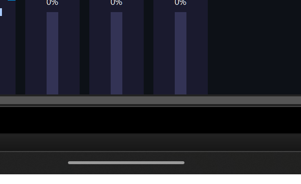

---

## 7. Speichern

**Strg+S** speichert direkt in die geladene `.lshow` (kein Dialog, wenn der Pfad schon
gesetzt ist). Die Titelleiste zeigt weiterhin den Dateipfad — gespeichert:

> „Speichern unter…" gibt es im Menü **Datei** (für eine Kopie unter neuem Namen).

---

## 8. Endergebnis

Bank 3 nach dem ganzen Workflow: vier Matrix-Effekte, die gebundene Taste
**„Feuer An/Aus"** und die drei neuen Fader **Speed · Submaster · Tempo Bus A** — sauber
ausgerichtet in der unteren Fader-Reihe neben den vorhandenen Fadern.

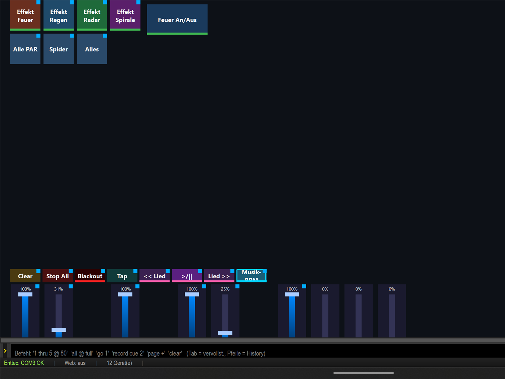

---

## Kurz-Spickzettel

| Aufgabe | Schritte |
|---|---|
| Editieren starten | „Bearbeiten" anklicken (→ „Bearbeiten ✓") · „MIDI Lernen" muss AUS sein |
| Element löschen | Rechtsklick auf Widget → „Löschen" |
| Effekt schnell aufbauen | Effekt aus Bibliothek **ziehen** → Karte „Effekt einrichten" (Häkchen + „Widget wählen") → „Erstellen" |
| Auf belegten Regler droppen | Karte „Regler ist schon belegt" → „Ersetzen" / „Dazu koppeln" / „Neues Widget daneben" |
| Element hinzufügen (manuell) | Toolbar „Button" / „Fader" / … (landet in der Mitte → ziehen) |
| Konfigurieren (manuell) | Widget **doppelklicken** → Einstellungen-Dialog |
| Effekt an/aus-Taste | Aktion „Funktion an/aus" + Funktion/Chase wählen |
| Speed | Fader-Modus „Speed (alle Effekte)" |
| Submaster | Fader-Modus „Submaster" |
| Mehrere Effekte / 1 BPM | Fader-Modus „Tempo-Bus (BPM)" + Bus A · eigene Effekte auf den Bus legen: beim Drop Aspekt „Tempo-Bus zuweisen…" ODER Rechtsklick → „⚡ Live-Parameter…" → Feld „Tempo-Bus" |
| Speichern | Strg+S (bzw. Datei → Speichern unter…) |

> **Hinweis:** Das Ergebnis dieser Demo liegt als `shows/Event_Demo_2026_WorkflowDemo.lshow`
> (Sicherung). Die Haupt-Show `shows/Event_Demo_2026.lshow` wurde wieder auf die
> unveränderte Voll-Version zurückgesetzt (Generator `tools/build_event_demo_2026.py`).
