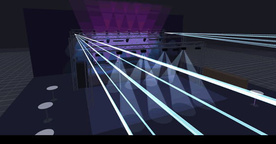
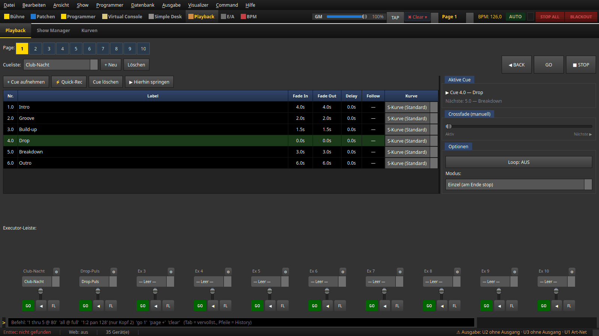
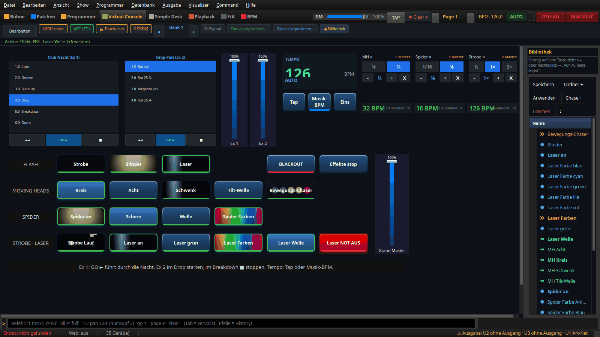
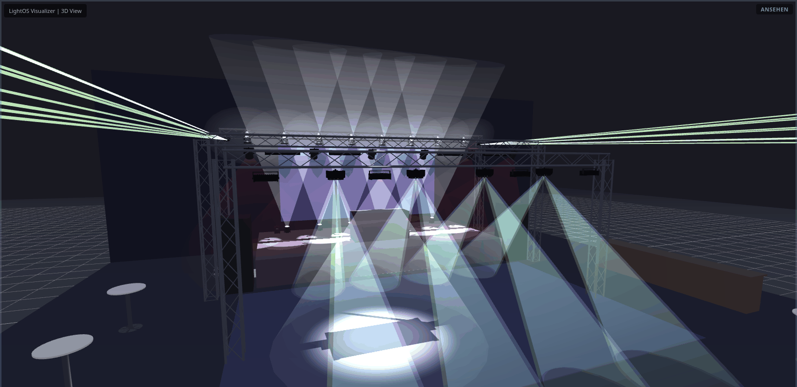
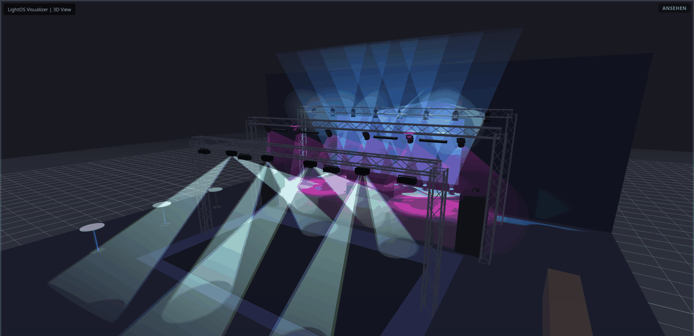

# Showcase „Club-Nacht" — Playback im Takt

Eine fertige Demo-Show für einen mittelgroßen Club. Sie zeigt, wie man eine
Nacht mit **Cue-Listen** fährt, während **Bewegungen und Chaser im Takt** der
Musik laufen. Alles ist mit mitgelieferten Geräteprofilen gebaut — du kannst
die Show ohne eigene Hardware im 3D-Visualizer ausprobieren.



Die zweite Showcase-Show ist [Theater/Event](theater_event.md) — ruhig, mit
Follow-Cues und Spots auf festen Positionen.

## Show erzeugen

```
./venv/bin/python tools/build_showcase_club.py
```

Das legt `shows/Showcase_Club_Nacht.lshow` an (eine vorhandene Datei wird nie
überschrieben, ein anderes Ziel gibt `--out PFAD.lshow` an) und speichert die
Bühne „Showcase Club-Nacht". Danach über **Datei → Öffnen…** laden und den
3D-Visualizer öffnen. Unter Windows heißt der Aufruf
`venv\Scripts\python tools\build_showcase_club.py`.

## Was drin ist

**Bühne:** DJ-Podest mit LED-Wand und DJ-Pult, zwei Traversen über dem Podest,
eine Traverse über der Tanzfläche, Boxen, eine Bar und Stehtische.

| Geräte | Profil | Wo |
|---|---|---|
| 12 PAR | Club Par 12-4 RGBW | 6 an der Front-Traverse, 6 Uplights vor der LED-Wand |
| 8 Moving Heads | Moving Head Spot 16ch (Gobo, Prisma, Zoom) | hintere Traverse |
| 4 Spider | Spider 14ch | Traverse über der Tanzfläche |
| 4 Strobes | Strobe 2ch | Traverse über der Tanzfläche |
| 4 Blinder | LED Blinder 2 COB | Front-Traverse, zum Publikum |
| 2 Laser | 3000mW RGB Laser | Enden der hinteren Traverse |
| 1 Hazer | HZ-1500 Pro | hinten auf dem Podest |

## Das Playback

Auf der **Executor-Seite 1 „Club-Nacht"** liegen zwei Cue-Listen:

| Executor | Cue-Liste | Inhalt |
|---|---|---|
| Ex 1 | **Club-Nacht** | 1 Intro · 2 Groove · 3 Build-up · 4 Drop · 5 Breakdown · 6 Outro — jede Cue ein Grundbild: Farben der PARs, Helligkeit, Farbrad, Gobo, Prisma und Zoom der Moving Heads. Weiter geht es mit **GO**. |
| Ex 2 | **Drop-Puls** | vier kurze Cues, **taktgebunden**: je Beat eine Cue. Sie überstimmen im Drop die Front-PARs (rot voll, rot 25 %, magenta, rot 25 %). Nach **■** gilt wieder Ex 1. |



Die Cue-Listen besitzen die Grundbilder. **Bewegung** kommt aus Effekten, die
du in der Virtual Console dazu schaltest — sie schreiben nur Pan/Tilt und
laufen deshalb mit jeder Cue weiter.

## Die Virtual Console



- **Cue-Listen (oben links):** „Club-Nacht (Ex 1)" und „Drop-Puls (Ex 2)" mit
  **◄◄** (BACK), **GO ►** und **■** (Stop). Daneben die **Playback-Fader**
  für Ex 1 und Ex 2.
- **Tempo:** Anzeige, **Tap**, **Musik-BPM** (Tempo aus dem Audio-Eingang) und
  **Eins** (Downbeat setzen). Alles hängt am globalen Tempo-Bus.
- **Speed-Dials:** „MH ×" (⅛ oder ¼), „Spider ×" (1/16 oder ⅛), „Strobe ×"
  (½, 1, 2).
- **FLASH:** Strobe, Blinder, Laser — Licht nur, solange die Taste gedrückt ist.
  Der FLASH-Laser hat eine eigene Szene („Laser Flash“): ist „Laser an“
  eingerastet, bleibt der Laser nach dem Loslassen an.
- **Moving Heads:** Kreis, Acht, Schwenk, Tilt-Welle und der
  **Bewegungs-Chaser**, der alle 16 Beats zur nächsten Figur wechselt. Die
  Tasten einer Reihe lösen sich gegenseitig ab.
- **Spider:** „Spider an" (Licht), Schere oder Welle (Bewegung),
  „Spider Farben" (Farbwechsel je Takt).
- **Strobe · Laser:** Strobe-Lauf, Laser an, Laser grün oder Laser-Farben,
  Laser-Welle und der rote **Laser NOT-AUS**.
- **Grand Master** rechts, **BLACKOUT** und **Effekte stop** oben.

## So spielst du die Nacht



1. **Tempo setzen:** Musik-BPM einschalten oder vier Mal **Tap** im Takt.
2. **Ex 1 GO** → Intro. Dazu „Kreis", „Spider an", „Welle", „Spider Farben".
3. **GO** → Groove. „Acht", „Laser an", „Laser Farben", „Laser Welle".
4. **GO** → Build-up. „Tilt-Welle", „Strobe Lauf"; kurz vor dem Drop
   **Blinder** halten.
5. **GO** → Drop, gleichzeitig **Ex 2 GO** (Drop-Puls). „Schwenk", „Schere";
   für einen Höhepunkt **Strobe** halten.
6. **GO** → Breakdown, **Ex 2 ■**. „Strobe Lauf" aus, „Kreis", „Welle".
7. **GO** → Outro: alles blendet in 6 Sekunden aus. Mit **◄◄** geht es jederzeit
   eine Cue zurück.

## Warum es ruhig aussieht

- **Bewegung im Takt, aber langsam.** Am Tempo-Bus wäre Faktor 1 eine ganze
  Figur je Beat — echte Moving Heads zittern dabei auf der Stelle. Die Moving
  Heads laufen deshalb mit **¼** (eine Figur je Takt), die Spider mit **⅛**,
  also langsamer als die Moving Heads. Die Speed-Dials bieten nur ruhige Stufen.
- **Farbe und Dimmer bleiben getrennt.** „Spider Farben" und „Laser Farben"
  wechseln nur die Farbe; Licht kommt aus „Spider an" bzw. „Laser an".
- Ohne Tempo laufen die Bewegungen frei im Grundtempo (126 BPM).



## Prüfen

```
./venv/bin/python tools/lint_show.py --strict shows/Showcase_Club_Nacht.lshow
```

Die Bilder dieser Seite erzeugt `tools/anleitungsbilder.py showcase` (VC und
Playback) bzw. `… showcase --bildschirm` (3D, am echten Bildschirm).
