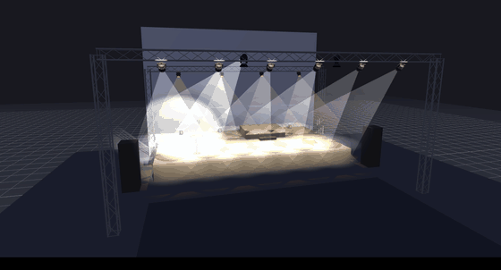
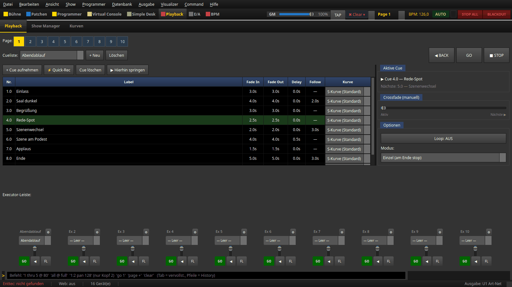
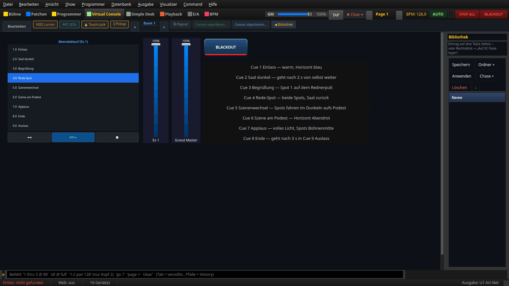
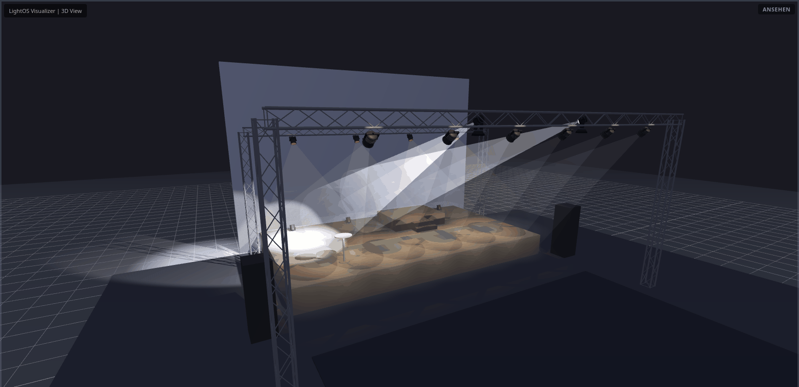
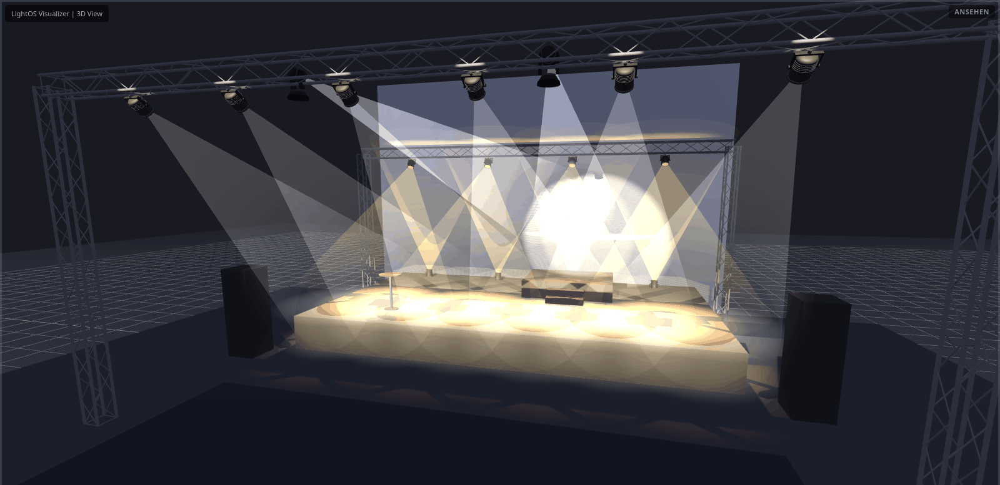

# Showcase „Theater/Event" — ein Abend auf einer Cue-Liste

Eine fertige Demo-Show für einen kleinen Saal: Begrüßung, Rede, eine Szene
und Applaus. Sie zeigt eine **ruhige Cue-Liste mit weichen Fades,
Wartezeiten und Follow-Cues** — und Spots, die genau dorthin zielen, wo
jemand steht. Alles ist mit mitgelieferten Geräteprofilen gebaut und im
3D-Visualizer ausprobierbar.



Die zweite Showcase-Show ist die [Club-Nacht](club_nacht.md) — im Takt, mit
Effekten und zwei Executoren.

## Show erzeugen

```
./venv/bin/python tools/build_showcase_theater.py
```

Das legt `shows/Showcase_Theater_Event.lshow` an (vorhandene Dateien werden nie
überschrieben, ein anderes Ziel gibt `--out PFAD.lshow` an) und speichert die
Bühne „Showcase Theater". Danach über **Datei → Öffnen…** laden und den
3D-Visualizer öffnen. Unter Windows:
`venv\Scripts\python tools\build_showcase_theater.py`.

## Was drin ist

**Bühne:** 12 × 7 m mit grauem Horizont, ein **Podest mit Treppe**, ein
**Rednerpult**, Boxen, eine FOH-Traverse über dem Publikum und eine Traverse
für das Gegenlicht. Im Saal stehen Stehtische und der Mischpult-Tisch.

| Geräte | Profil | Wo |
|---|---|---|
| 6 Frontlicht | RUSH Par 2 RGBW Zoom | FOH-Traverse |
| 4 Gegenlicht | LED Par56 MKII RGBW | Gegenlicht-Traverse |
| 4 Horizont | Co9 V2 LED Flood RGBW | am Boden vor dem Horizont |
| 2 Spots | ERA 300 Profile | FOH-Traverse |

## Die Cue-Liste „Abendablauf"

Sie liegt auf **Executor 1** der Seite „Abend".



| Cue | Bild | Zeiten |
|---|---|---|
| 1 Einlass | warmes Licht, Horizont blau | Fade 3 s |
| 2 Saal dunkel | nur der Horizont glimmt | Fade 4 s, **folgt nach 2 s** |
| 3 Begrüßung | Frontlicht, Spot 1 auf dem Rednerpult | Fade 3 s |
| 4 Rede-Spot | beide Spots auf dem Pult, Saal zurück | Fade 2,5 s |
| 5 Szenenwechsel | Blaulicht, Spots fahren **im Dunkeln** aufs Podest | Fade 2 s, Pan/Tilt 2 s verzögert, **folgt nach 3 s** |
| 6 Szene am Podest | Spots auf dem Podest, Horizont Abendrot | **Wartezeit 0,5 s**, Fade 4 s |
| 7 Applaus | volles Licht, Spots auf die Bühnenmitte | Fade 1,5 s |
| 8 Ende | alles aus, Horizont blau | Fade 5 s, **folgt nach 3 s** |
| 9 Auslass | warmes Saallicht | Fade 4 s |

**Follow** heißt: Ist der Fade fertig und die Follow-Zeit abgelaufen, geht die
Liste von selbst zur nächsten Cue. Du drückst also nur sechs Mal **GO**, nicht
neun Mal.

## Bedienen



- **GO ►** startet die nächste Cue, **◄◄** geht eine zurück, **■** hält an.
- Der Fader **Ex 1** regelt die ganze Cue-Liste, **Grand Master** alles.
- Rechts steht der Ablauf als Spickzettel.

## Spots auf Positionen



Die Spot-Positionen **Rednerpult**, **Bühnenmitte** und **Podest** sind mit
derselben Rechnung entstanden wie das Werkzeug **⌖ Zielen** im 3D-Visualizer:
aus der Lage der Spots und der Objekte auf der Bühne. Sie liegen zusätzlich als
**Positions-Paletten** („Spot Rednerpult" …) in der Show — so lassen sich
eigene Cues mit denselben Zielen bauen.



Hängst du die Spots im 3D um oder schiebst das Podest, zielst du mit **⌖ Zielen**
neu und nimmst die Position in die Cue auf.

## Prüfen

```
./venv/bin/python tools/lint_show.py --strict shows/Showcase_Theater_Event.lshow
```

Die Bilder dieser Seite erzeugt `tools/anleitungsbilder.py showcase` (VC und
Playback) bzw. `… showcase --bildschirm` (3D, am echten Bildschirm).
