# LightOS — Schritt‑für‑Schritt: Matrix · Chase · Moving‑Head‑EFX · Virtuelle Konsole

> **Nachschlagewerk.** Alle Bilder und GIFs in dieser Anleitung sind **live im
> laufenden LightOS** entstanden, während die Effekte wirklich gespielt haben.
> Die fertige Show liegt unter **`shows/Tutorial_Matrix.lshow`** — öffnen mit
> **Datei → Öffnen…** (Strg+O). Sie überschreibt **keine** deiner anderen Shows.

**Beispiel‑Rig:** 8 × *LED PAR Dimmer+RGB 4ch* (als 4×2‑Matrix) + 2 × *Moving Head Spot 8ch*.

Warum genau dieses PAR‑Profil? Weil es **Dimmer und Farbe auf getrennten DMX‑Kanälen**
hat (Kanal 1 = Dimmer, 2/3/4 = R/G/B). Genau das brauchen wir, um später **Farbe**
und **Helligkeit** als zwei **getrennte Ebenen** sauber übereinanderzulegen.

---

## Inhalt

1. [Geräte patchen](#1-geräte-patchen)
2. [In der Live‑View platzieren](#2-in-der-live-view-platzieren)
3. [Gruppen anlegen](#3-gruppen-anlegen)
4. [Matrix‑Effekte – Farbe, Dimmer und beides als Ebenen](#4-matrix-effekte)
5. [Chase (Lauflicht) live bauen](#5-chase-lauflicht-live-bauen)
6. [Moving‑Head‑Effekt (Kreis)](#6-moving-head-effekt-kreis)
7. [Virtuelle Konsole einrichten](#7-virtuelle-konsole-einrichten)
8. [Speichern](#8-speichern)
9. [Spickzettel / Cheat‑Sheet](#9-spickzettel)

---

## 1. Geräte patchen

**Sektion „Patchen" → `+ Gerät hinzufügen`.** Es öffnet sich der Geräte‑Browser.
Oben ins **Suchfeld** den Profilnamen tippen (hier `Dimmer+RGB`), links das Profil
anklicken, rechts unter **Patch‑Optionen** die **Anzahl** setzen.

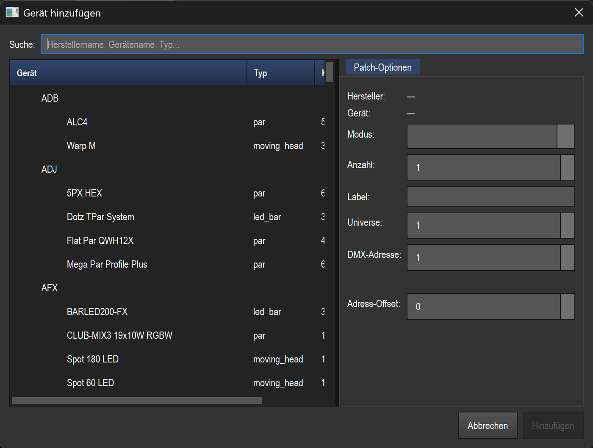

Für die 8 PARs:

| Feld | Wert |
|------|------|
| Gerät | **LED PAR Dimmer+RGB 4ch** (Hersteller *Generic*) |
| Modus | 4‑Kanal Dimmer+RGB |
| **Anzahl** | **8** |
| Universe | 1 |
| DMX‑Adresse | 1 *(LightOS schlägt automatisch die nächste freie Adresse vor)* |

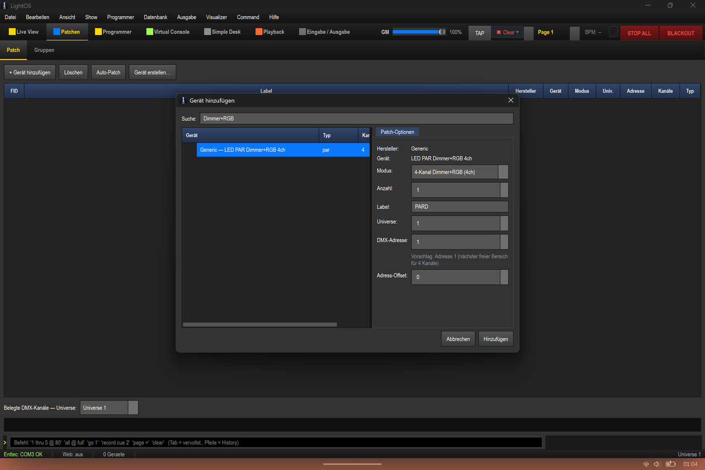

Dann **`Hinzufügen`** klicken. Anschließend dasselbe für die Moving Heads:
*Moving Head Spot 8ch*, **Anzahl 2**, DMX‑Adresse **33** (direkt hinter den
8 PARs, die 1–32 belegen).

Ergebnis – die Patch‑Tabelle: 8 PARs (Adressen 1, 5, 9 … 29) + 2 MH (33, 41):

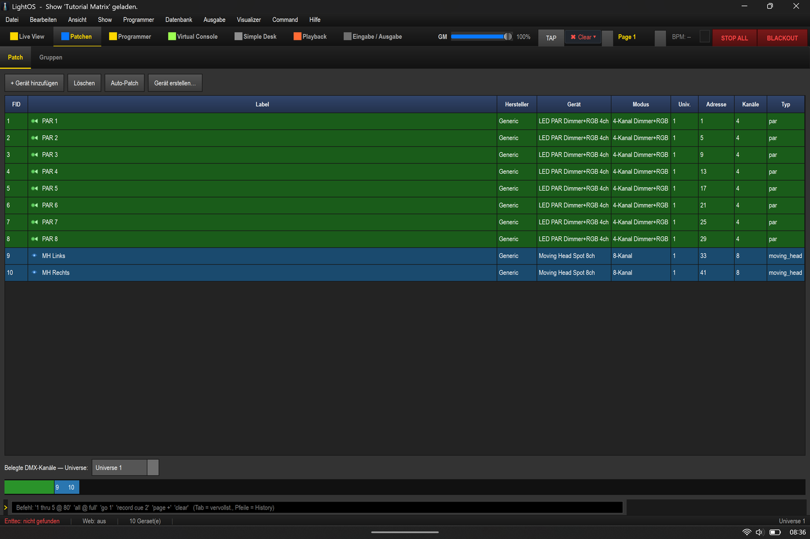

> 💡 Jede Zeile lässt sich per Doppelklick umbenennen (Spalte **Label**).
> 4 Kanäle × 8 PARs = 32 Kanäle, deshalb starten die MH bei Adresse 33.

---

## 2. In der Live-View platzieren

In der Sektion **„Live View"** ordnest du die Strahler so an, wie sie real auf
der Bühne stehen. Hier: die 8 PARs als **4×2‑Block**, die 2 Moving Heads darüber.
Die Live‑View zeigt **live** Farbe und Helligkeit jedes Geräts – das ist unser
„Monitor" für alle folgenden Effekte.

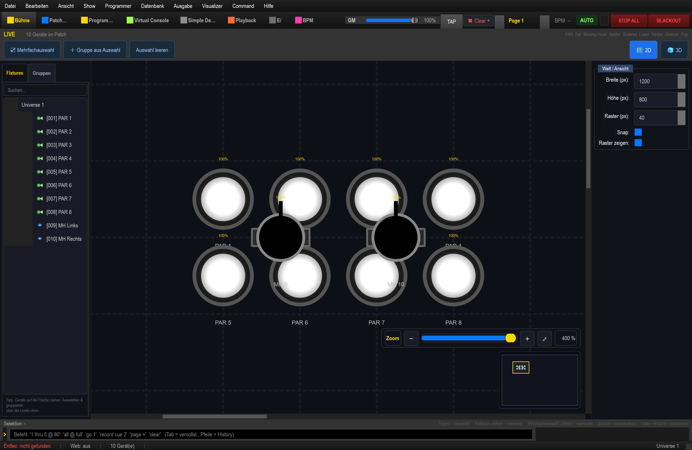

*(Alle Geräte stehen hier auf Weiß/100 % – das ist der Grundzustand der Show.)*

---

## 3. Gruppen anlegen

Gruppen fassen Geräte zusammen, damit Effekte „die ganze Gruppe" treffen.

### So legst du eine Gruppe an (live)

1. In der Live‑View **`☑ Mehrfachauswahl`** aktivieren.
2. Mit der Maus ein **Auswahl‑Rechteck** über die 8 PARs ziehen → sie bekommen
   einen gelben Ring (Statuszeile: *„Selektion: 8 Fixtures"*).

   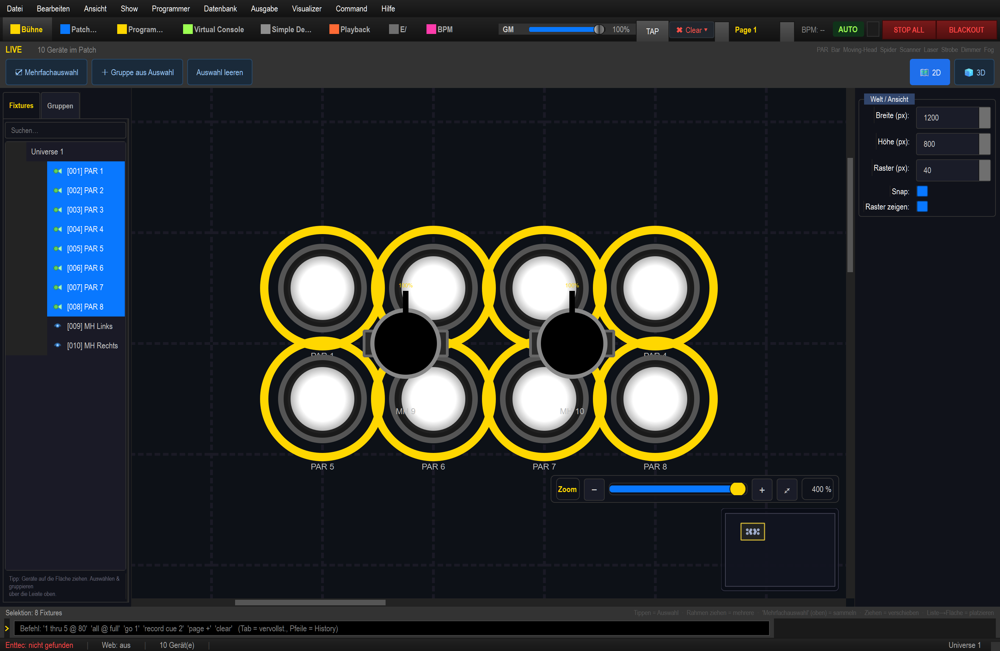

3. **`＋ Gruppe aus Auswahl`** klicken, im Dialog einen **Namen** vergeben, **OK**.

   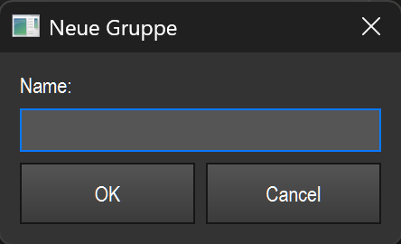

### Die fertigen Gruppen

Im **Patchen → Fixture‑Gruppen** siehst du jede Gruppe als Raster. Das Raster
(Spalten × Zeilen) bestimmt später die **Matrix‑Form** – das Matrix‑Raster
selbst entsteht im Editor über den Button **„Aus Auswahl"**.

**PAR‑Matrix** – 4 Spalten × 2 Zeilen, Geräte 1–8:

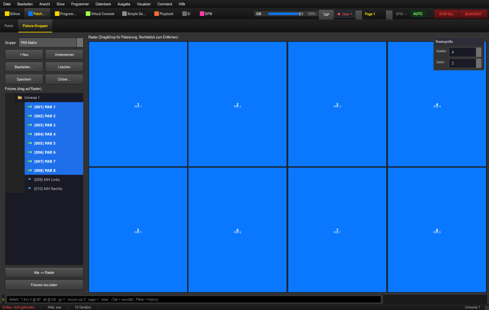

**Moving Heads** – 2 × 1, Geräte 9–10:

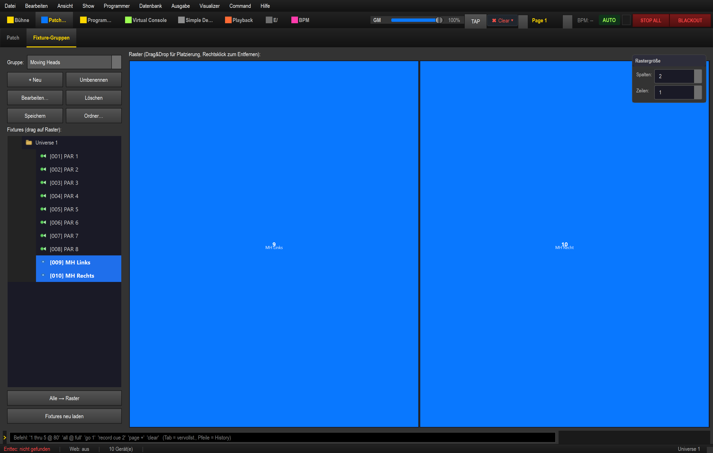

> 💡 Für diese Tutorial‑Show gibt es 3 Gruppen: **PAR‑Matrix**, **Moving Heads**
> und die eben live gebaute **Alle PARs**.

---

## 4. Matrix-Effekte

Eine **RGB‑Matrix** legt ein Muster (Regenbogen, Gradient, Lauflicht …) über das
**Raster** einer Gruppe. Entscheidend ist der **Style** (Auswahl **`Style:`** im
Editor) – er bestimmt **ganz allein**, **welche Kanäle** die Matrix anfasst:

| Style | schreibt nur … | lässt unangetastet |
|-------|----------------|--------------------|
| **RGB** | Farbe (R/G/B) | den Dimmer‑Kanal |
| **Dimmer** | den Dimmer‑Kanal (Helligkeit) | die Farbe |

> 💡 Die Trennung läuft **ausschließlich über den Style** – einen Extra‑Schalter
> „Dimmer treiben" gibt es **nicht** (mehr). RGB‑Style fasst nur die Farbkanäle
> an, Dimmer‑Style nur den Dimmer‑Kanal. Genau deshalb lassen sich beide als
> **getrennte Ebenen** kombinieren.

Editor: **Programmer → Reiter „Matrix"** (Matrix ist einer der Reiter oben im
Programmer). Links die Matrix‑Liste, rechts Einstellungen + **Vorschau**, unten
**▶ Start / ■ Stop**.

### 4.1 Reine Farb‑Matrix (Regenbogen)

Algorithmus **Rainbow**, Style **RGB**, Raster **4×2**. Durch den RGB‑Style
setzt die Matrix **nur** R/G/B, der Dimmer bleibt, wo er ist.

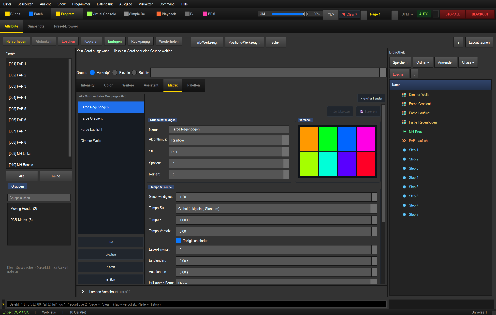

Mit **▶ Start** läuft der Regenbogen über die 8 PARs (Helligkeit kommt aus dem
Grundzustand 100 %):

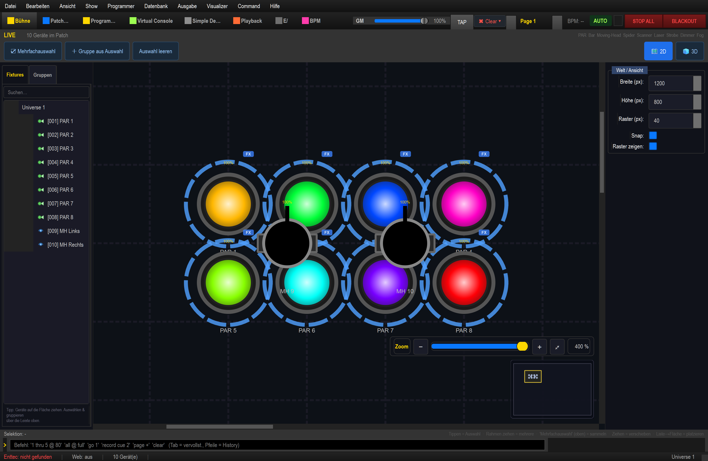


### 4.2 Reine Dimmer‑Matrix (Helligkeits‑Welle)

Algorithmus **Wave**, Style **Dimmer**. Die Vorschau ist **grau** – es geht nur
um Helligkeit, **nicht** um Farbe.

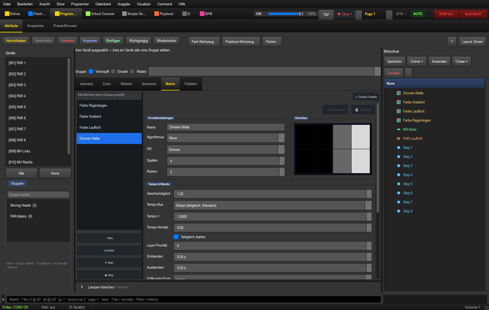

Live: die PARs bleiben **weiß**, aber eine **Helligkeits‑Welle** wandert über
sie hinweg:

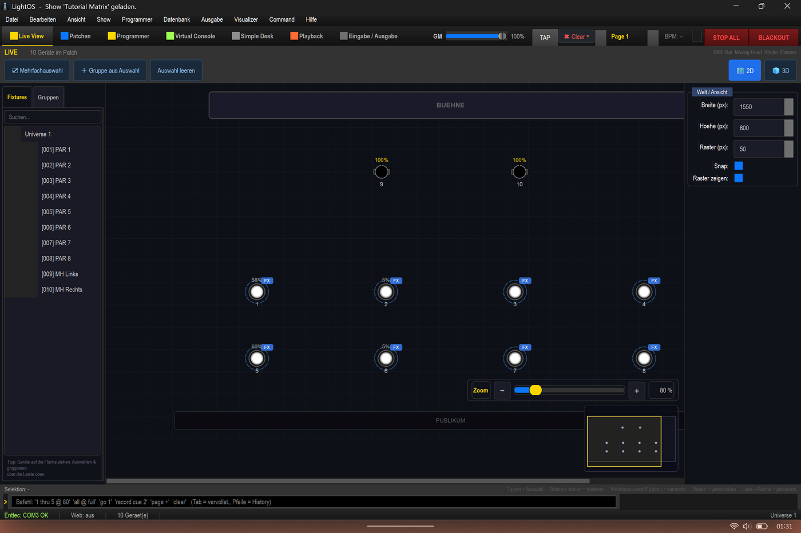

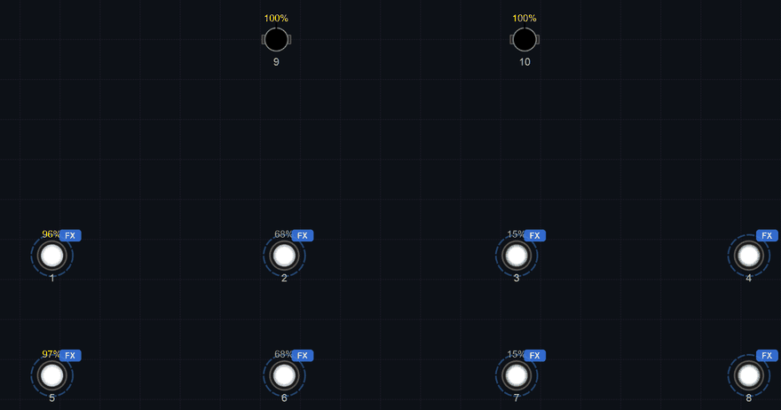

### 4.3 Beide zusammen = Layering

Jetzt das Wichtigste: **Farb‑Matrix und Dimmer‑Matrix gleichzeitig starten.**
Weil die eine nur R/G/B und die andere nur den Dimmer schreibt, **stören sie
sich nicht** – sie ergänzen sich:

> **Farbe** kommt von Ebene 1, **Helligkeit** von Ebene 2 → bewegte Farbe **mit**
> Helligkeits‑Welle.

In der Live‑View erkennst du das am Badge **„FX2"** an jedem PAR: **zwei**
Effekte treiben dasselbe Gerät (Farbe + Dimmer):

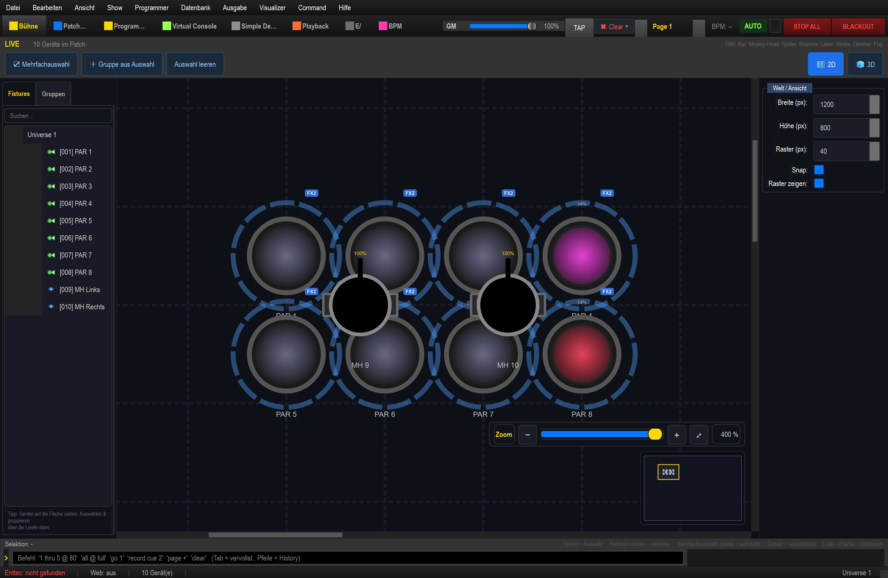

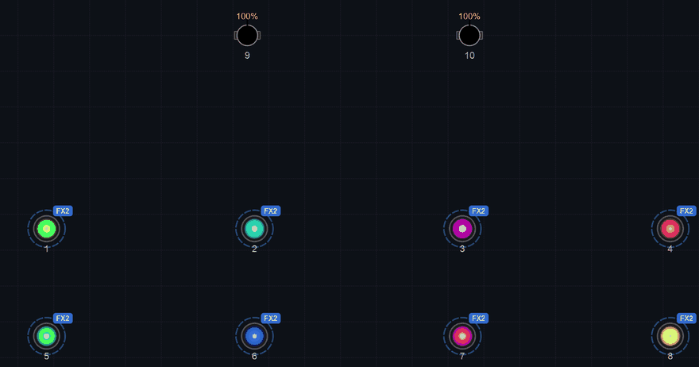

**Warum trennt man das?** Weil man so jede Eigenschaft einzeln steuern kann:
denselben Farb‑Look mit ruhiger ODER pulsierender Helligkeit fahren, die
Helligkeits‑Welle behalten und nur die Farbe wechseln, jede Ebene per eigenem
Fader dimmen … Eine Ebene, die *beides* macht, nimmt dir diese Freiheit.

---

## 5. Chase (Lauflicht) live bauen

Ein **Chaser** schaltet gespeicherte **Schritte** der Reihe nach durch. Unser
„PAR‑Lauflicht" hat 8 Schritte – pro Schritt leuchtet **ein** PAR.

Editor öffnen: in der **Bibliothek** (Programmer rechts) auf den Chaser
**Rechtsklick → Bearbeiten…**


Im Editor steuerst du alles, was einen Chase ausmacht:

- **`+ Hinzufügen`** – aktuellen Programmer‑Zustand (oder eine Funktion) als
  Schritt **erfassen**.
- **Fade In / Hold / Fade Out** pro Schritt – wie schnell ein‑/wie lange gehalten wird.
- **Nach oben / Nach unten** – **Reihenfolge** ändern.
- **Run Order** (Loop / PingPong / …) – das **Hin‑und‑Her** ist die Run Order
  **PingPong**, nicht eine Direction.
- **Direction** (Forward/Backward) und **Speed** (×‑Faktor).

Gestartet wandert das Licht über die 4×2‑Matrix:

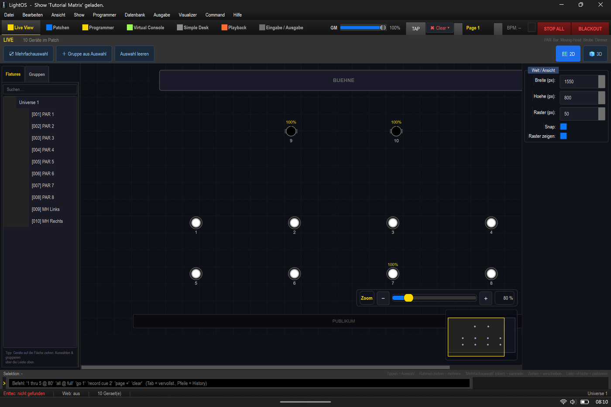

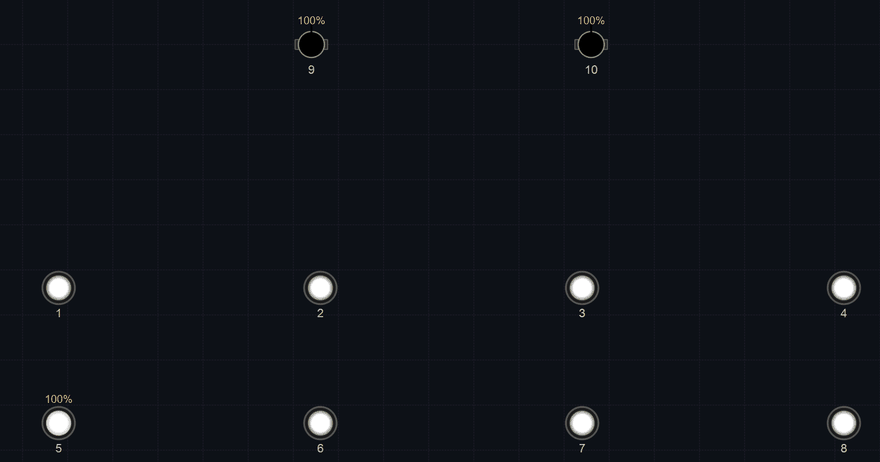

---

## 6. Moving-Head-Effekt (Kreis)

Ein **EFX** bewegt Pan/Tilt auf einer geometrischen Bahn. Editor:
**Programmer → Reiter „EFX"** (EFX ist einer der Reiter oben im Programmer).

- **Algorithmus: Circle** (die meisten Namen stehen **englisch** im Auswahlfeld:
  *Circle, Eight, Line, Diamond, Square, Lissajous, Triangle* — einzelne deutsch wie *Trapez*)
- **Breite (Pan‑Hub) / Höhe (Tilt‑Hub):** Größe des Kreises
- **Zentrum Pan / Tilt:** Mittelpunkt (128 = Mitte)
- **Geschwindigkeit** und **Richtung** (*forward / backward / bounce*)

Die Vorschau zeichnet die Bahn; die Punkte sind die beiden Moving Heads, die
darauf im Kreis laufen:

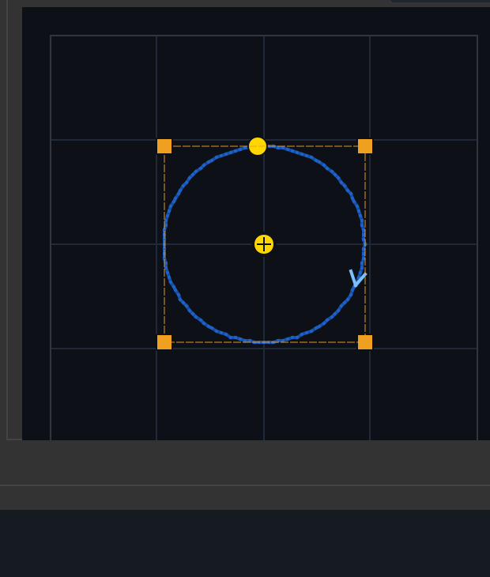


> 💡 Über das **Verhältnis der Geräte** (Streuung/Phase) kann man die zwei Köpfe
> auch versetzt laufen lassen (z. B. gegenüberliegend). Hier laufen sie synchron.

---

## 7. Virtuelle Konsole einrichten

Die **Virtuelle Konsole (VC)** ist deine Spiel‑Oberfläche: **Pads** starten
Effekte, **Fader** und **Drehregler** steuern sie live.

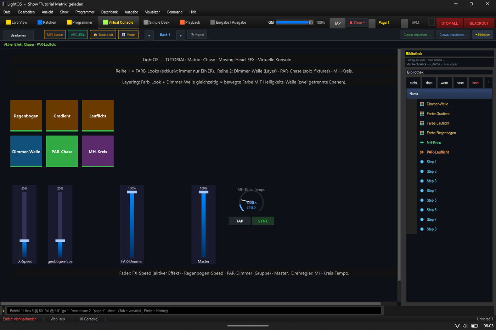

In dieser Show:

- **Reihe 1 – Farb‑Looks:** Regenbogen · Gradient · Lauflicht *(exklusiv)*
- **Reihe 2:** Dimmer‑Welle *(Layer)* · PAR‑Chase *(Geräte‑Solo)* · MH‑Kreis
- **Fader:** FX‑Speed · Regenbogen‑Speed · PAR‑Dimmer (Gruppe) · Master
- **Drehregler:** MH‑Kreis‑Tempo

### a) Funktionen auf Pads ziehen (Drag‑in)

Rechts ist die **Bibliothek** mit allen Funktionen. Eintrag einfach **auf eine
leere Fläche** der Konsole ziehen – oder **Rechtsklick → „➡ Auf VC‑Taste legen"**.

**Was beim Ziehen passiert:** Lässt du den Effekt auf einer **leeren** Stelle
(leeres Canvas/Pad) los, öffnet sich die **Drop‑Karte „Effekt einrichten"**. Sie
fragt *„… — was soll dieser Effekt können?"* und zeigt je Aspekt eine
**Ankreuz‑Zeile**. **„An/Aus" (Toggle) ist bereits vorangekreuzt** – ein Klick
auf **`Erstellen`** liefert also genau das **einfache An/Aus‑Pad**. Setzt du
weitere Häkchen (z. B. Tempo, Helligkeit, Farbe), entstehen in **einem** Schritt
mehrere fertig verdrahtete Widgets.


- **Widget‑Galerie:** Hat ein Aspekt mehrere passende Bedien‑Elemente, steht in
  der Zeile **„Widget: … ▸ ändern"** – ein Klick öffnet die grafische
  **Galerie** (*„Bedien‑Element wählen — tippe eine Kachel an"*) mit gemalten
  Vorschau‑Kacheln.
- **Konflikt‑Karte:** Ziehst du einen Effekt auf einen **schon belegten** Regler,
  erscheint die Karte **„Regler ist schon belegt"** mit den drei
  Auswahlmöglichkeiten **„Ersetzen"**, **„Dazu koppeln"** (bindet beide Effekte an
  denselben Regler: eine Gruppe, ein Tempo) oder **„Neues Widget daneben"**.
- Ein vorhandenes Bedien‑Element lässt sich später per Kontextmenü
  **„↔ Widget ändern"** auf einen anderen Typ umstellen.

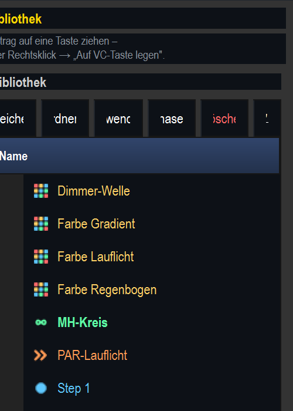

### b) Pads/Fader benennen & konfigurieren

Im **Bearbeiten**‑Modus ein Pad **doppelklicken** → *Button Einstellungen*.
Das Feld **Beschriftung** ist der **Name** auf dem Pad.

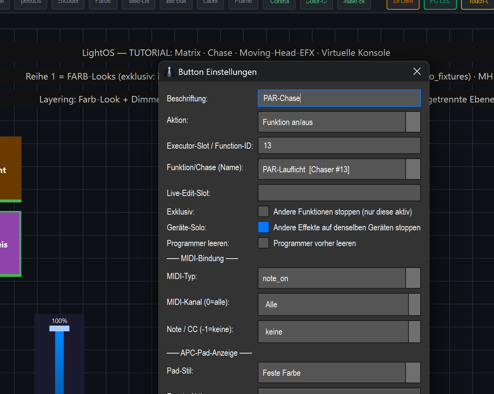

### c) „Immer nur EIN Effekt aktiv" — exklusiv & Geräte‑Solo

Im selben Dialog (siehe Bild oben) gibt es zwei Schalter:

- **Exklusiv** – *„Andere Funktionen stoppen (nur diese aktiv)"*: beim Drücken
  wird **alles andere** gestoppt. Ideal für sich **gegenseitig ausschließende
  Looks** (unsere 3 Farb‑Looks sind exklusiv → es läuft immer nur **einer**).
- **Geräte‑Solo** – *„Andere Effekte auf denselben Geräten stoppen"*: stoppt nur
  Effekte, die **dieselben Geräte** benutzen, lässt den Rest weiterlaufen. Unser
  **PAR‑Chase** nutzt das: er übernimmt die PARs, der Moving‑Head‑Kreis läuft
  ungestört weiter.

> Unterschied in einem Satz: **Exklusiv = global** „nur ich", **Geräte‑Solo =
> nur auf meinen Geräten" ich.

### d) Geschwindigkeit per Fader / Drehregler

- Ein **Fader** im Modus **Effekt‑Tempo** regelt das Tempo – entweder eines
  **bestimmten** Effekts (`Regenbogen‑Speed`) oder des **gerade aktiven** Effekts
  (`FX‑Speed`).
- Der **Drehregler (SpeedDial)** „MH‑Kreis‑Tempo" steuert das Kreis‑Tempo als
  Multiplikator (mit Tap/Sync).
- **PAR‑Dimmer** ist ein **Gruppen‑Dimmer** (dimmt die ganze PAR‑Matrix),
  **Master** der Grand‑Master.

### e) Wie die Effekte zusammenwirken (Layering / Priorität)

Mehrere Pads gleichzeitig sind erlaubt, solange sie **verschiedene Ebenen**
treiben. In der Live‑View zeigt das Badge **FX2/FX3** an, wie viele Effekte ein
Gerät gerade bespielen:


Faustregel der Priorität (von unten nach oben):

```
Grundzustand (base) ─▶ Funktionen/Effekte ─▶ Executoren (Cues) ─▶ Programmer
```

- **Farbe** und **Dimmer** liegen auf **verschiedenen Kanälen** → sie **addieren**
  sich (Layering, kein Konflikt).
- Greifen zwei Effekte **denselben** Kanal an, gewinnt der zuletzt gestartete
  (bzw. der Effekt „besitzt" den Kanal). Genau dafür gibt es **Exklusiv** und
  **Geräte‑Solo**, um Konkurrenz gezielt aufzulösen.

---

## 8. Speichern

**Datei → Speichern** (Strg+S) – diese Show liegt bereits als
**`shows/Tutorial_Matrix.lshow`** vor und wurde mit allen Gruppen, Matrizen, dem
Chaser, dem MH‑EFX und der kompletten Virtuellen Konsole gesichert.
*(Sie ist neu angelegt und überschreibt keine bestehende Show.)*

---

## 9. Spickzettel

| Aufgabe | Weg in LightOS |
|---------|----------------|
| Gerät patchen | Patchen → `+ Gerät hinzufügen` → suchen, Anzahl, Adresse → `Hinzufügen` |
| Gruppe bauen | Live View → `☑ Mehrfachauswahl` → Rechteck ziehen → `＋ Gruppe aus Auswahl` → benennen |
| Reine Farbe | Programmer → Reiter **Matrix** → Style **RGB** |
| Reiner Dimmer | Programmer → Reiter **Matrix** → Style **Dimmer** |
| Farbe + Dimmer | beide Matrizen **gleichzeitig** starten → Badge **FX2** |
| Chase bauen | Bibliothek → Rechtsklick Chaser → **Bearbeiten…** → `+ Hinzufügen`, Hold/Speed, Nach oben/unten |
| MH‑Bewegung | Programmer → Reiter **EFX** → Algorithmus **Circle**, Hub/Zentrum/Speed |
| Funktion auf Pad | Bibliothek‑Eintrag auf leere Fläche **ziehen** → Drop‑Karte „Effekt einrichten" → `Erstellen` (oder Rechtsklick → „➡ Auf VC‑Taste legen") |
| Pad benennen | Bearbeiten‑Modus → Pad doppelklicken → **Beschriftung** |
| Nur 1 Effekt aktiv | Pad‑Dialog → **Exklusiv** ✓ |
| Nur auf eigenen Geräten solo | Pad‑Dialog → **Geräte‑Solo** ✓ |
| Effekt‑Tempo per Fader | Fader‑Modus **Effekt‑Tempo** (bestimmter oder aktiver Effekt) |
| Alles stoppen | **STOP ALL** (oben rechts) |

---

*Erstellt mit LightOS · Show: `shows/Tutorial_Matrix.lshow` · Generator:
`tools/build_tutorial_matrix_show.py`. Alle Screenshots & GIFs wurden live im
laufenden Programm aufgenommen.*
